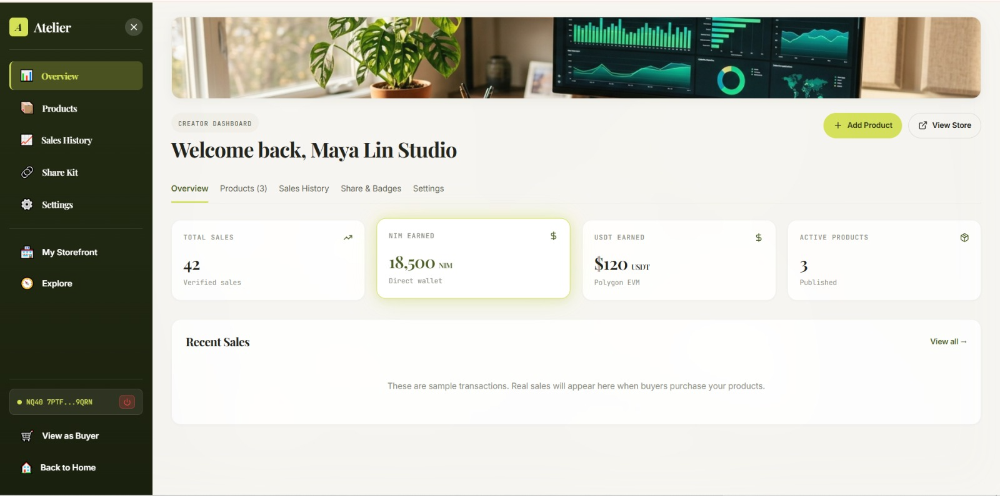
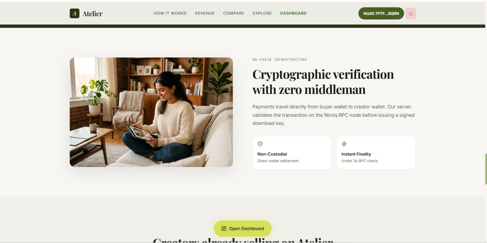

# Atelier
> Your digital storefront. One link. Instant NIM.

| Field | Value |
| --- | --- |
| Category | Marketplaces |
| Pricing | Free |
| Team name | _Not provided — optional_ |
| Team members | _Not provided — optional_ |
| X account | 0xkinno |
| Contact email | ojilerekingsley@gmail.com |
| GitHub login | @0xkinno |
| Submitted at | 2026-07-31T01:09:00.000Z |

## Links

| Link | URL |
| --- | --- |
| Repo | [https://github.com/0xkinno/atelier](<https://github.com/0xkinno/atelier>) |
| Demo | [https://atelier-fawn-seven-53.vercel.app](<https://atelier-fawn-seven-53.vercel.app>) |
| Video | [https://youtu.be/ugT1-2piNLY?si=9UaadsKQzxxgUail](<https://youtu.be/ugT1-2piNLY?si=9UaadsKQzxxgUail>) |

## Description

Atelier is a zero-commission creator storefront built as a Nimiq Pay Mini App. Creators connect their wallet, publish digital products in under sixty seconds, and get paid instantly in NIM or USDT, wallet to wallet, with every transaction verified on chain.

## Builder story

Creators lose money before the sale even clears. Gumroad takes 10 percent, Stripe takes another 3, and payouts land a week later. I built Atelier to remove that middle entirely. Connect your wallet, publish in sixty seconds, get paid wallet to wallet in under three seconds, verified on chain. No accounts, no cut, no waiting.

## Screenshots

---
_Generated from the submission form. `submission.yaml` in this folder is the machine-readable source of truth._