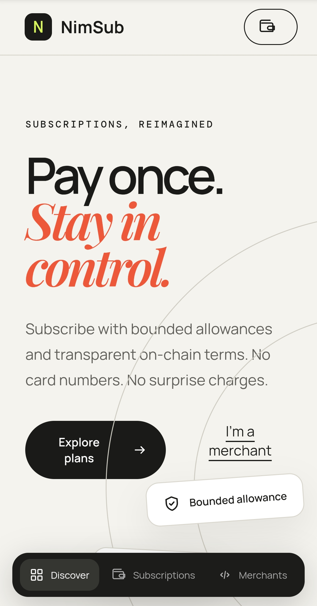
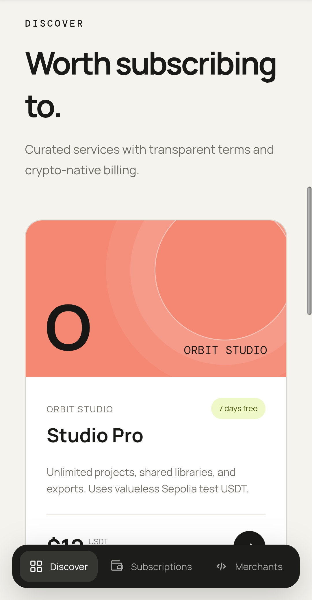
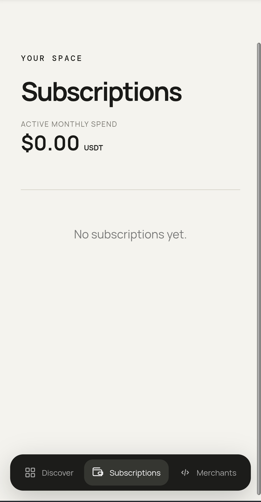
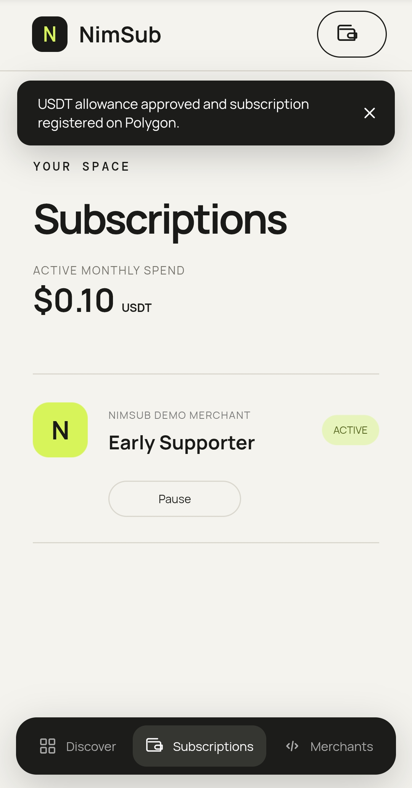
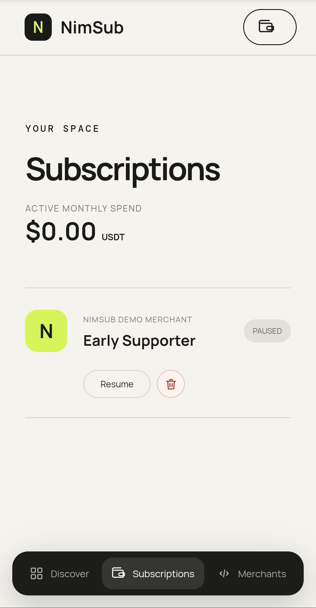

# NimSub

> Subscription Billing API

| Field | Value |
| --- | --- |
| Category | Creator tools |
| Pricing | Free |
| Team name | _Not provided — optional_ |
| Team members | _Not provided — optional_ |
| X account | benra1sofian |
| Contact email | benrawane2012@gmail.com |
| GitHub login | @BenraouaneSoufiane |
| Submitted at | 2026-07-28T10:59:41.158Z |

## Links

| Link | URL |
| --- | --- |
| Repo | [https://github.com/benraouanesoufiane/NimSub](<https://github.com/benraouanesoufiane/NimSub>) |
| Demo | [https://nimsub.xyz](<https://nimsub.xyz>) |
| Video | [https://www.youtube.com/shorts/nNIwqBxOqXc](<https://www.youtube.com/shorts/nNIwqBxOqXc>) |

## Description

It provides simple sdk to let merchants setup subscriptions for their services, enable them to accept reccuring payments from customers using Nimiq Pay, the subscribe button then appears in their store & the plan listed in NimSub.

## Builder story

I saw web3 subscription apps are missed, first tried to built with erc7710 then switched to manuall contract creation (because Nimiq sdk not supprt it), it actually resolves big problem of accepting reccuring payments in web3, so it's the native payment subscription provider reshaped.

## Thumbnail

## Screenshots

---

_Generated from the submission form. `submission.yaml` in this folder is the machine-readable source of truth._
