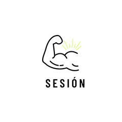
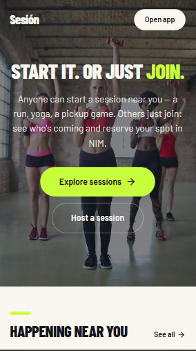
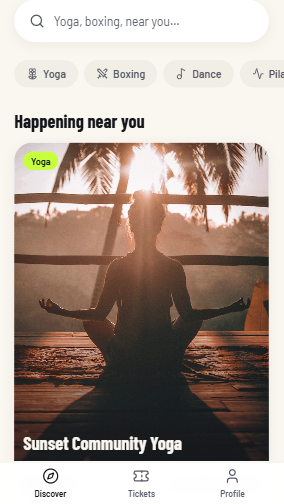
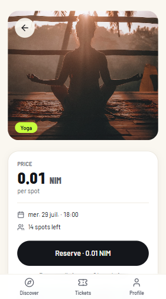
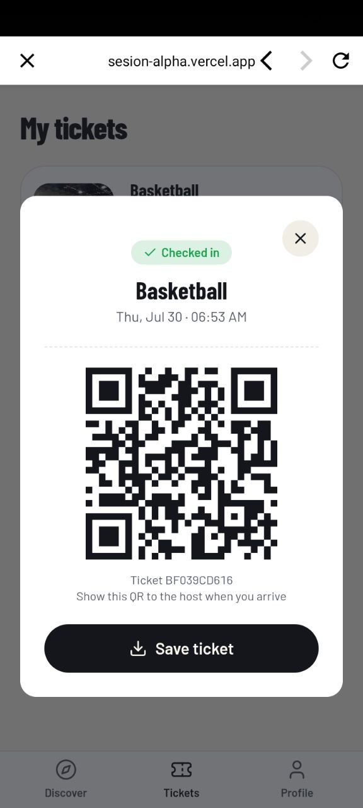

# Sesión

> Anyone can start a session near you. Others just join. Reserve your spot in NIM.

| Field | Value |
| --- | --- |
| Category | Health & fitness |
| Pricing | Paid |
| Team name | _Not provided — optional_ |
| Team members | _Not provided — optional_ |
| X account | Shadrakbsh |
| Contact email | shadrakbsh@gmail.com |
| GitHub login | @Bsh54 |
| Submitted at | 2026-07-26T20:15:14.403Z |

## Links

| Link | URL |
| --- | --- |
| Repo | [https://github.com/Bsh54/sesion](<https://github.com/Bsh54/sesion>) |
| Demo | [https://sesion-alpha.vercel.app/](<https://sesion-alpha.vercel.app/>) |
| Video | [https://youtu.be/0hWEX0SxrDY?si=K_neegiG7G_R-MQl](<https://youtu.be/0hWEX0SxrDY?si=K_neegiG7G_R-MQl>) |

## Description

Sesión makes it simple for anyone to start a fitness session in their area — a run, yoga, a pickup game — and for others to just join. You see who's coming and reserve your spot in NIM, so people actually show up.

## Builder story

_Not provided — optional_

## Thumbnail

## Screenshots

---

_Generated from the submission form. `submission.yaml` in this folder is the machine-readable source of truth._
