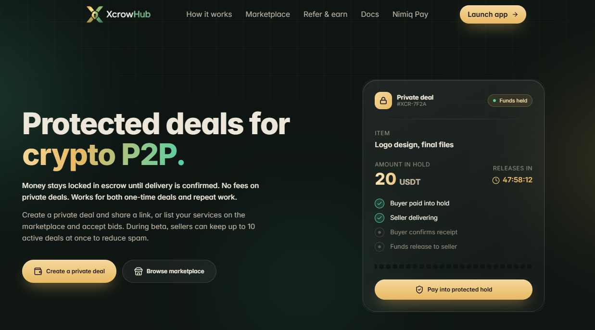
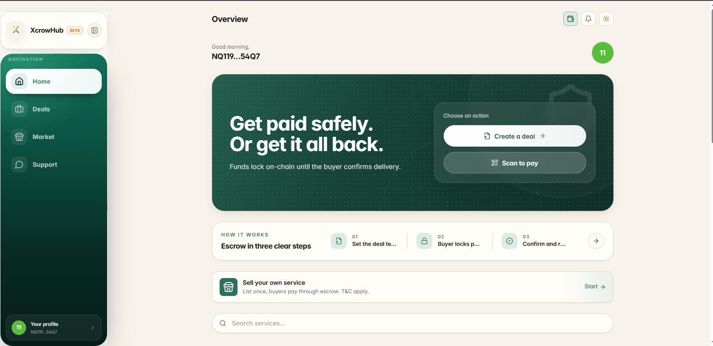
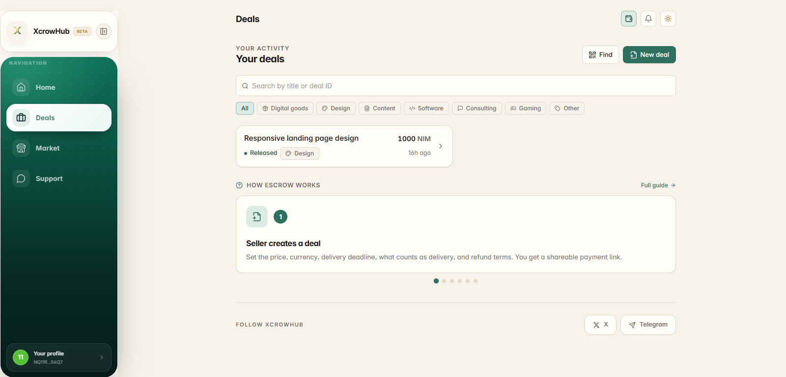
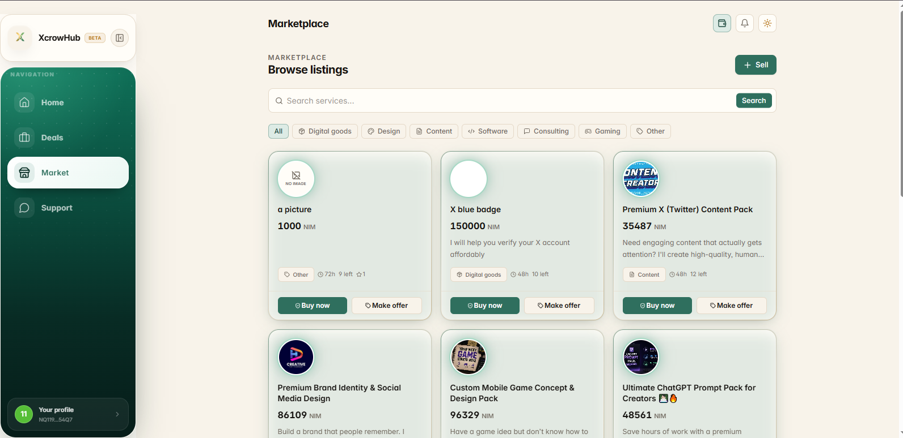
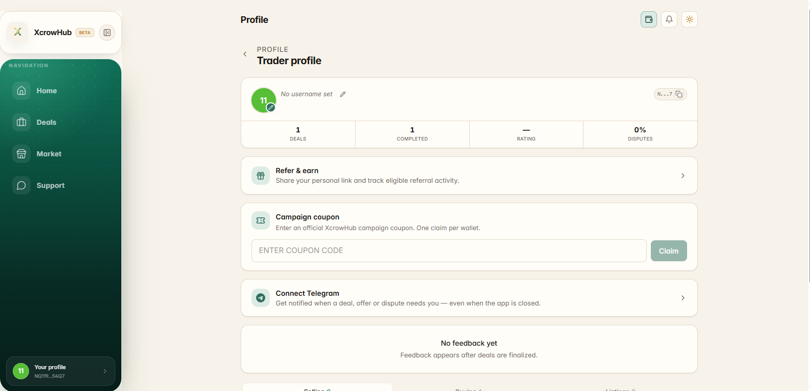
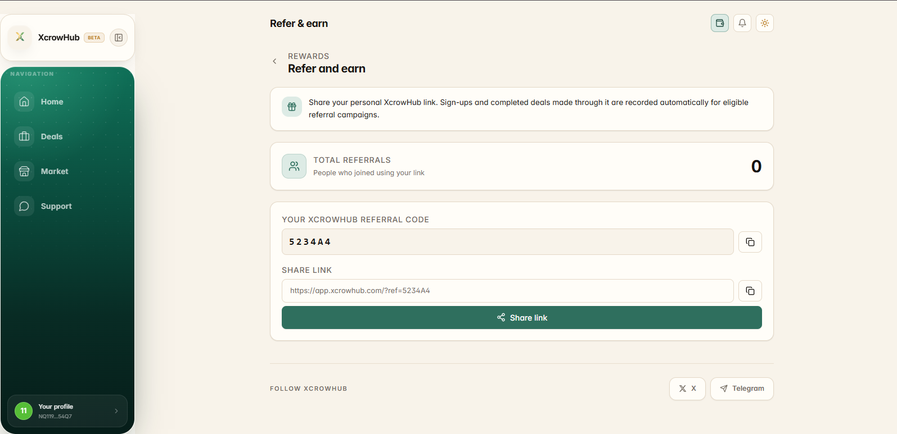

# XcrowHub

> Create the deal. Protect the payment. Deliver with confidence.

| Field | Value |
| --- | --- |
| Category | Marketplaces |
| Pricing | Freemium |
| Team name | Xcrowhub |
| Team members | Tahseen Faizi (Founder & head dev + marketing), Alveera (Speaker), Moses (Support) |
| X account | xcrowhub |
| Contact email | official@xcrowhub.com |
| GitHub login | @DropXpert |
| Submitted at | 2026-07-31T03:27:00.036Z |

## Links

| Link | URL |
| --- | --- |
| Repo | [https://github.com/DropXpert/Xcrowhub](<https://github.com/DropXpert/Xcrowhub>) |
| Demo | [https://app.xcrowhub.com](<https://app.xcrowhub.com>) |
| Video | [https://youtu.be/TOZlpH5D3pI](<https://youtu.be/TOZlpH5D3pI>) |

## Description

XcrowHub is a Nimiq Pay escrow marketplace for freelancers, digital sellers, and buyers. It turns NIM or USDT payments into structured deals with delivery terms, proof, confirmation, refunds, disputes, QR links, bidding, and transparent settlement.

## Builder story

After being scammed several times in direct crypto deals, I knew the usual "pay first and trust me" flow had to change. I built XcrowHub so buyers and sellers could agree on clear terms, protect payment, and prove delivery. I personally invested 400,000 NIM in marketing, onboarded 160+ users, recorded 200+ Nimiq transactions, and shaped the product through real community feedback.

## Thumbnail

## Screenshots

---

_Generated from the submission form. `submission.yaml` in this folder is the machine-readable source of truth._
