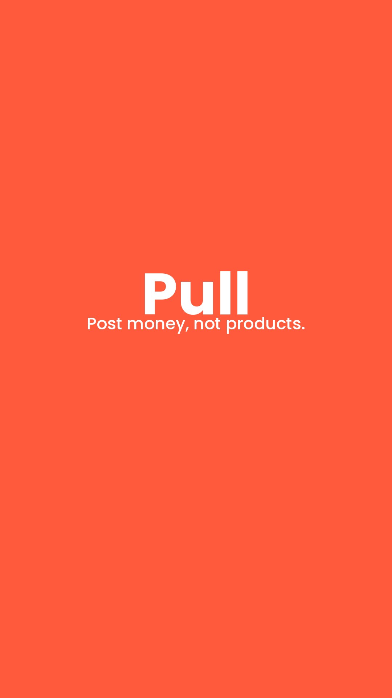
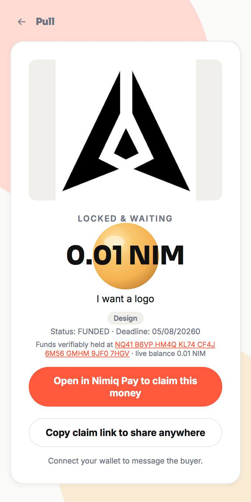
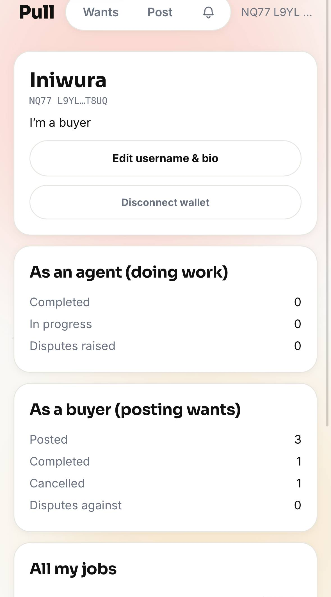
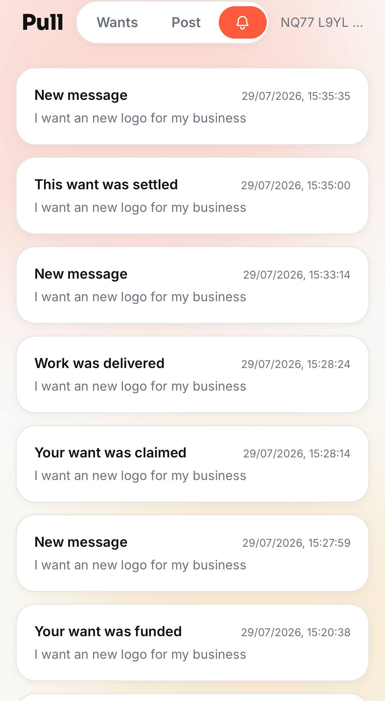
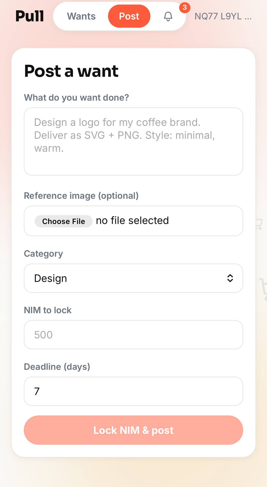

# Pull

> Post money, not products.

| Field | Value |
| --- | --- |
| Category | Marketplaces |
| Pricing | Free |
| Team name | _Not provided — optional_ |
| Team members | _Not provided — optional_ |
| X account | saitama_xc |
| Contact email | iniwuraakuru@gmail.com |
| GitHub login | @Iniwura |
| Submitted at | 2026-07-29T17:26:12.754Z |

## Links

| Link | URL |
| --- | --- |
| Repo | [https://github.com/Iniwura/pull](<https://github.com/Iniwura/pull>) |
| Demo | [https://pull-production-3070.up.railway.app/](<https://pull-production-3070.up.railway.app/>) |
| Video | [https://youtu.be/GjiOzZaCdkA](<https://youtu.be/GjiOzZaCdkA>) |

## Description

Lock NIM behind a task instead of hiring someone directly. Post what you want done, share the link, and the first person to claim it gets paid on delivery.

## Builder story

I kept seeing the same problem everywhere:
 freelance platforms make you trust a client's word, or trust a platform's dispute team, before any money is real. Pull inverts that. The buyer locks real NIM on-chain before anyone even claims the job, so trust isn't a promise, it's a balance you can check yourself. I built the whole escrow, chat, and reputation system from scratch on native NIM, using the Mini Apps SDK, because I wanted the payment rail to be the actual product

## Thumbnail

## Screenshots

---

_Generated from the submission form. `submission.yaml` in this folder is the machine-readable source of truth._
