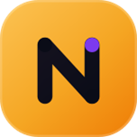
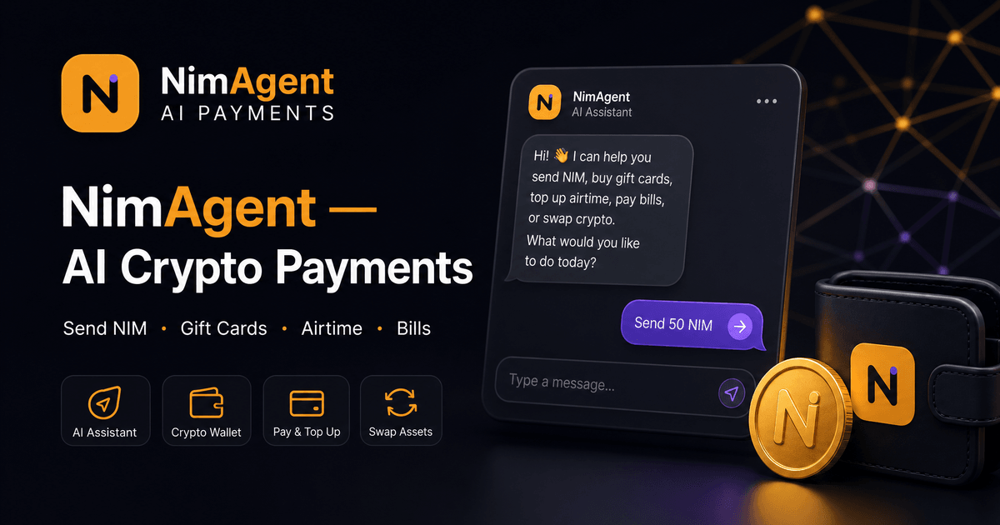
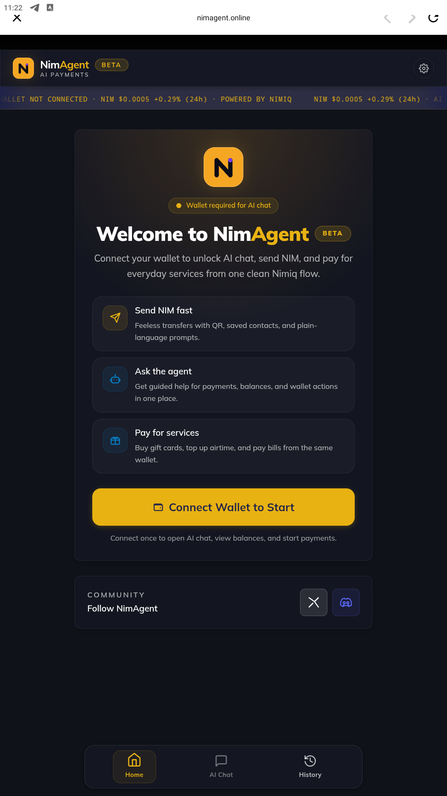
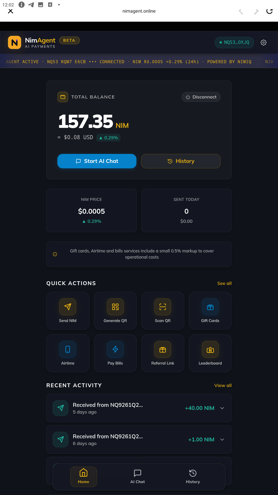
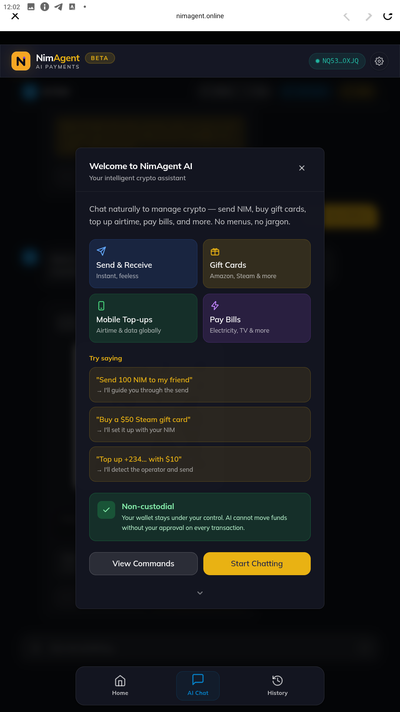
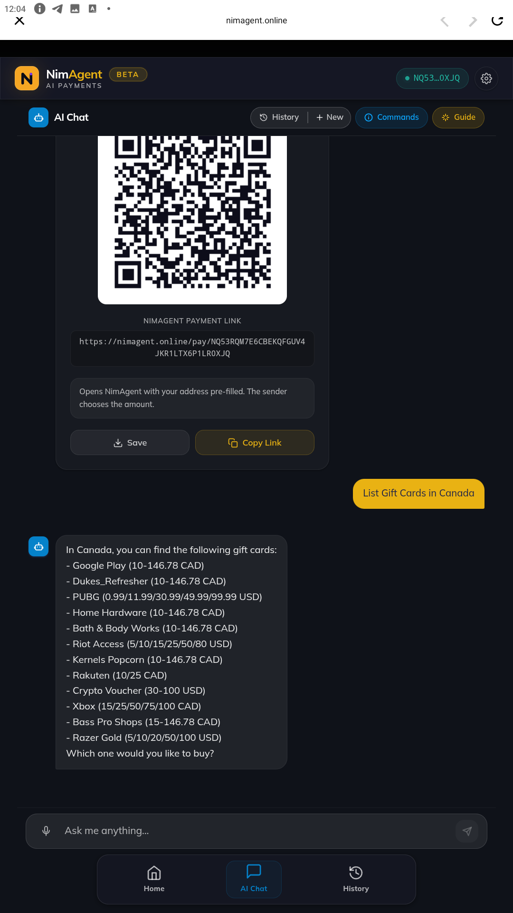
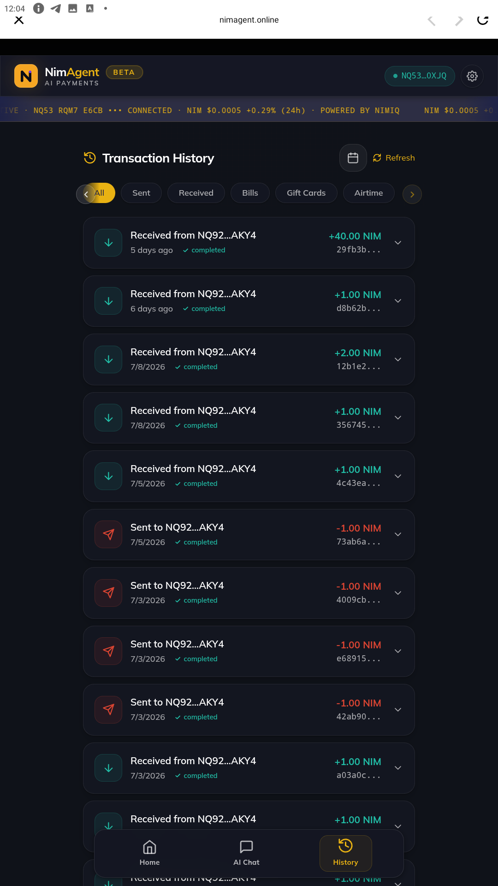

# NimAgent

> Crypto as Easy as a Conversation.

| Field | Value |
| --- | --- |
| Category | Shopping & deals |
| Pricing | Free |
| Team name | LegendaryTunz Studios |
| Team members | Christopher Okunade |
| X account | nimiqagent |
| Contact email | princecph4@gmail.com |
| GitHub login | @LegendaryTunzeverywhere |
| Submitted at | 2026-07-25T06:56:05.087Z |

## Links

| Link | URL |
| --- | --- |
| Repo | [https://github.com/LegendaryTunzeverywhere/NimAgent](<https://github.com/LegendaryTunzeverywhere/NimAgent>) |
| Demo | [https://nimagent.online](<https://nimagent.online>) |
| Video | [https://x.com/NimiqAgent/status/2080909441457672306?s=20](<https://x.com/NimiqAgent/status/2080909441457672306?s=20>) |

## Description

NimAgent is an AI payment assistant that makes crypto as easy as talking to someone. Send money, buy gift cards, recharge airtime and pay bills in seconds with simple natural language.

## Builder story

A few months ago, I found myself in a situation that many crypto users can relate to. I was completely out of cash, but I had cryptocurrency that I had been saving. I urgently needed to buy mobile data to stay connected, yet the platforms available either didn't support what I had or imposed limits that made it impossible to use directly.

To get something as simple as airtime, I had to sell my crypto, swap it for USDT, transfer it to another platform, and then finally purchase my data. By the time I was done, I had lost money to trading and network fees all just to buy something that should have taken seconds.

That experience made me realize that cryptocurrency still isn't as practical as it should be for everyday life.

That's why I built NimAgent. The vision evolved into something much bigger: an AI-powered payment assistant that lets people use their NIM for real-world needs without unnecessary complexity. Whether it's buying airtime, purchasing gift cards, or paying utility bills, NimAgent bridges the gap between the Nimiq ecosystem and everyday digital services, making cryptocurrency genuinely useful when it matters most.

Building a product backed by blockchain has always been a personal ambition of mine, not just to launch another crypto application but to solve a problem I experienced firsthand. That experience gave me a clear purpose, and it continues to drive every decision I make while building NimAgent. I'm committed to creating a product that people genuinely rely on, and this competition is an opportunity to prove that a simple idea, built around real user needs, can have meaningful impact.

## Thumbnail

## Screenshots

---

_Generated from the submission form. `submission.yaml` in this folder is the machine-readable source of truth._
