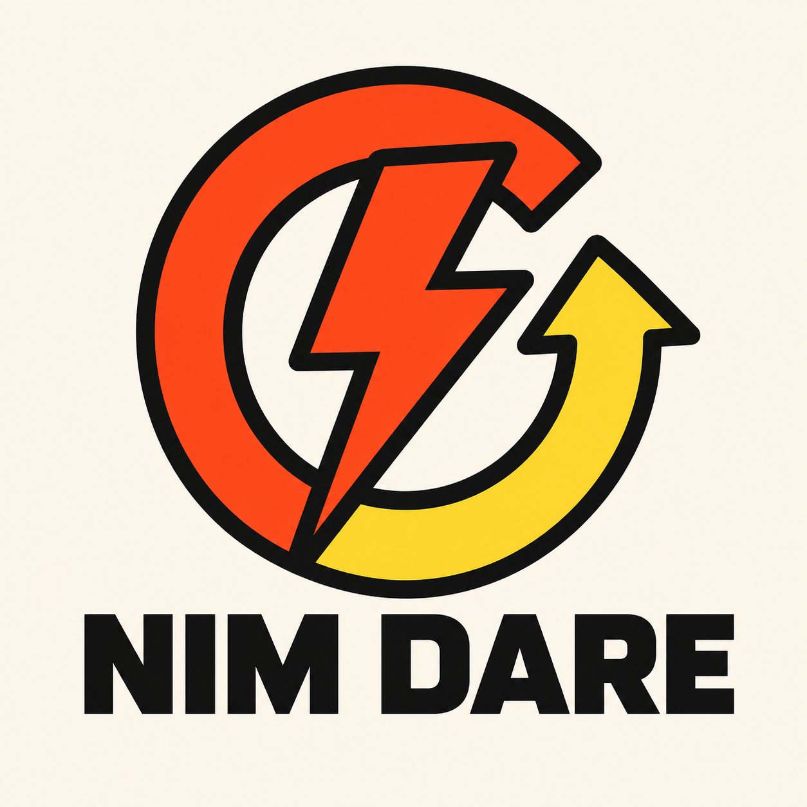
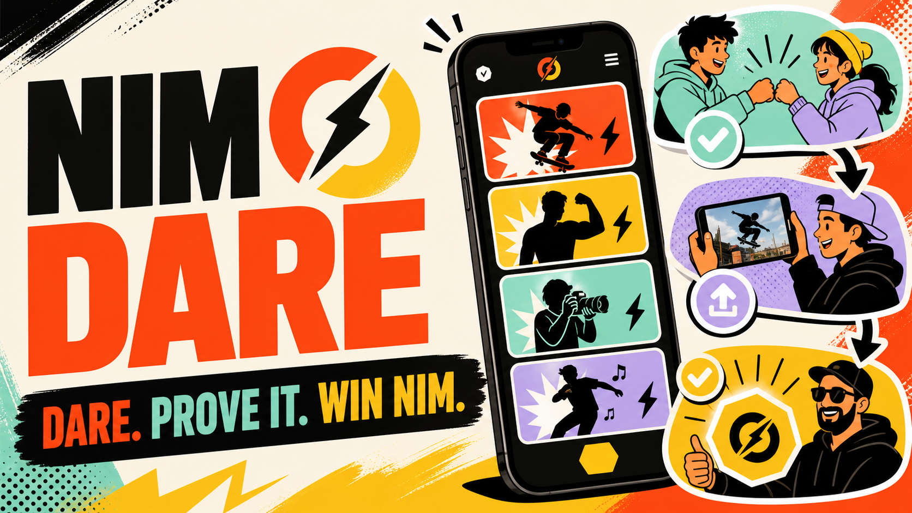
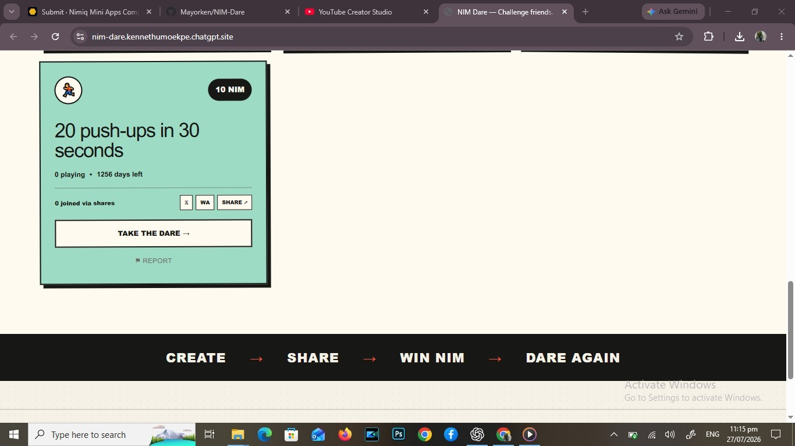
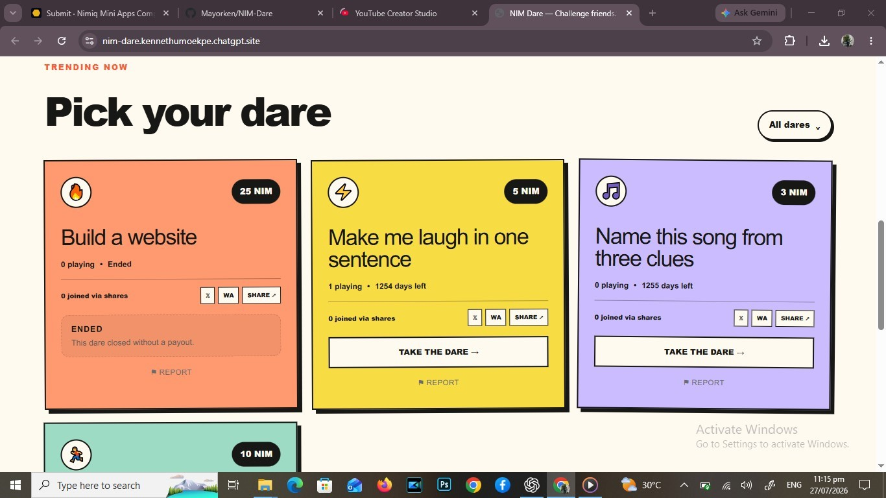
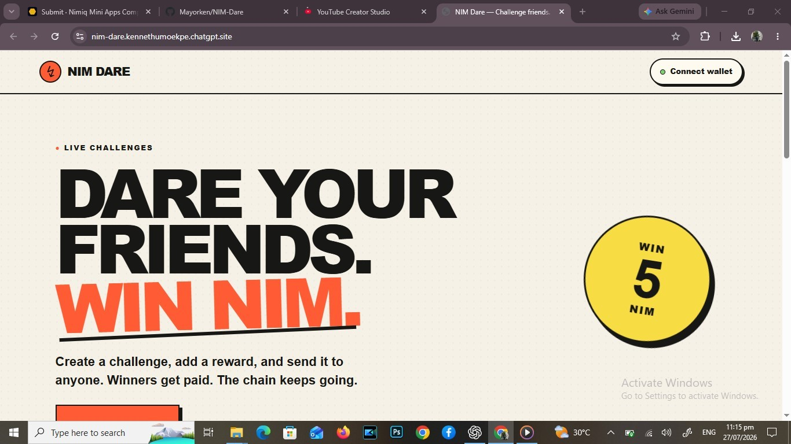

# Nim Dare

> Dare your friends. Prove it. Win NIM.

| Field | Value |
| --- | --- |
| Category | Social |
| Pricing | Free |
| Team name | _Not provided — optional_ |
| Team members | kenneth umoekpe |
| X account | kennycrypt96 |
| Contact email | kennethumoekpe@gmail.com |
| GitHub login | @Mayorken |
| Submitted at | 2026-07-27T22:20:20.398Z |

## Links

| Link | URL |
| --- | --- |
| Repo | [https://github.com/Mayorken/NIM-Dare](<https://github.com/Mayorken/NIM-Dare>) |
| Demo | [https://nim-dare.kennethumoekpe.chatgpt.site/](<https://nim-dare.kennethumoekpe.chatgpt.site/>) |
| Video | [https://youtu.be/hVq8TwfsC30](<https://youtu.be/hVq8TwfsC30>) |

## Description

NIM Dare is a social challenge Mini App for Nimiq Pay. Create and share dares, submit proof, choose a winner, and send non-custodial NIM rewards directly from your wallet.

## Builder story

_Not provided — optional_

## Thumbnail

## Screenshots

---

_Generated from the submission form. `submission.yaml` in this folder is the machine-readable source of truth._
