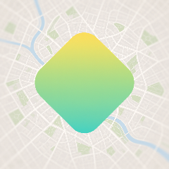
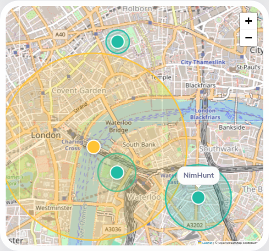
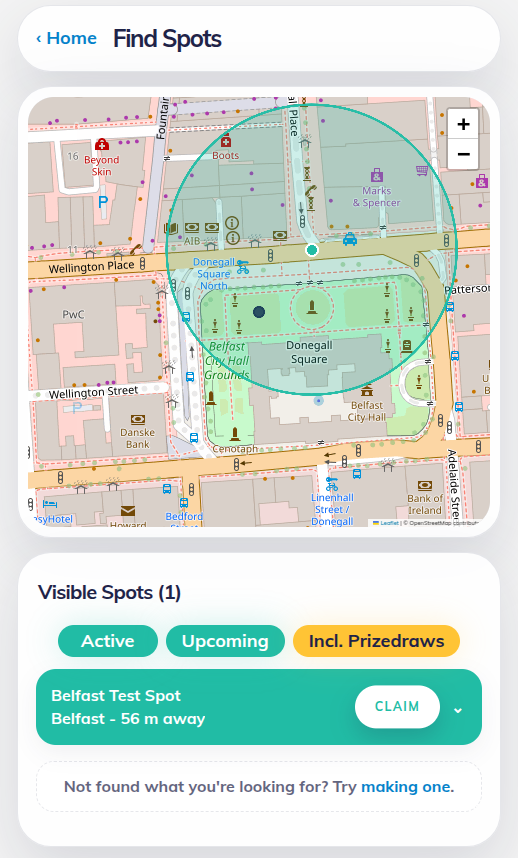
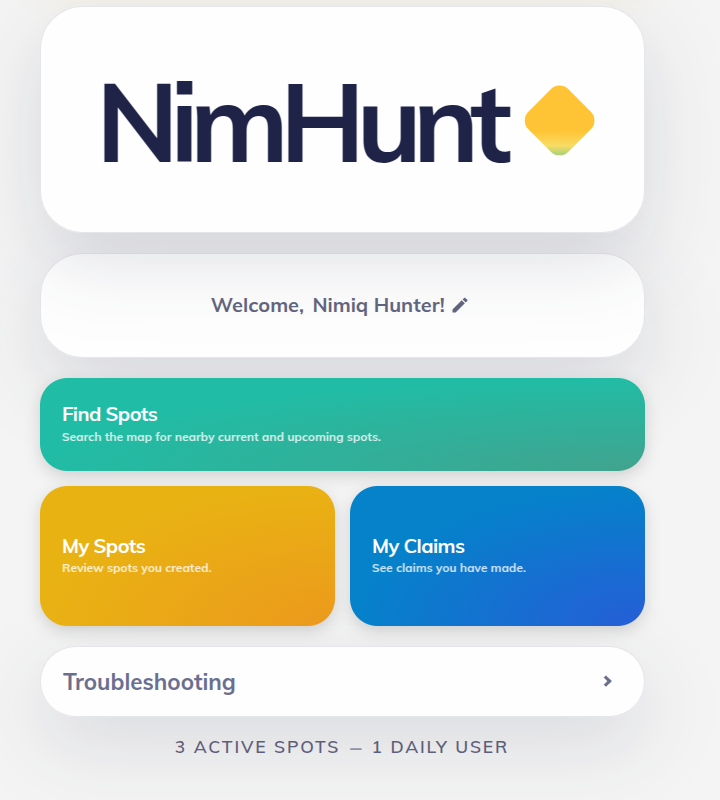

# NimHunt

> Create Spots. Explore Locations. Claim NIM.

| Field | Value |
| --- | --- |
| Category | Earning |
| Pricing | Free |
| Team name | _Not provided — optional_ |
| Team members | _Not provided — optional_ |
| X account | NIM_Hunt |
| Contact email | dneiper@protonmail.com |
| GitHub login | @NIMHunt |
| Submitted at | 2026-07-26T18:33:18.450Z |

## Links

| Link | URL |
| --- | --- |
| Repo | [https://github.com/NIMHunt/nim-hunt](<https://github.com/NIMHunt/nim-hunt>) |
| Demo | [https://nimhunt.app](<https://nimhunt.app>) |
| Video | [https://youtu.be/ckeDf-iLEFY](<https://youtu.be/ckeDf-iLEFY>) |

## Description

NimHunt is a geofaucet and prizedraw mini-app for Nimiq Pay. Creators fund location-based Spots, while nearby users discover them via app, visit in person, and claim free NIM or enter free draws.

## Builder story

I am not a programmer, but I've been interested in Nimiq for years. Other than HODLing, I felt like I couldn't contribute to nimiq. I thought I would give this a go since AI was expressly permitted. I've tried cool crypto apps before, so I thought I would try my hand at making one.
Long, long ago, I enjoyed the NANO app, WeNano. So why not make something for the obviously superior crypto?

## Thumbnail

## Screenshots

---

_Generated from the submission form. `submission.yaml` in this folder is the machine-readable source of truth._
