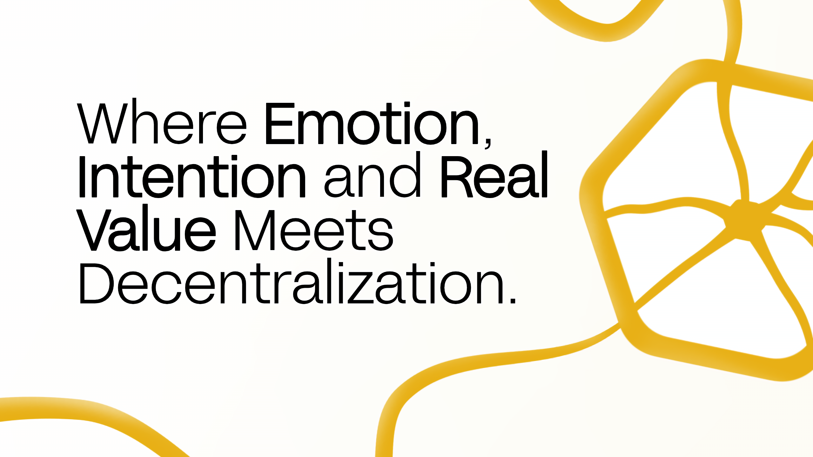
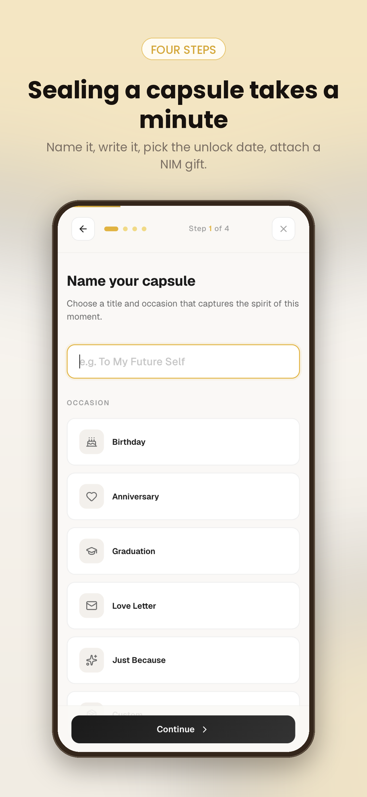
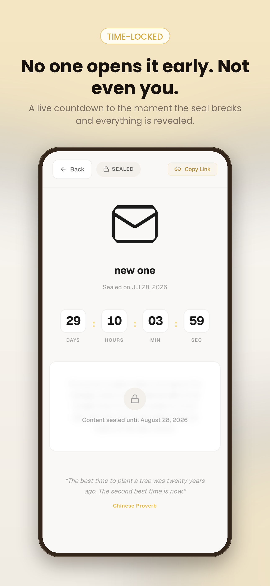
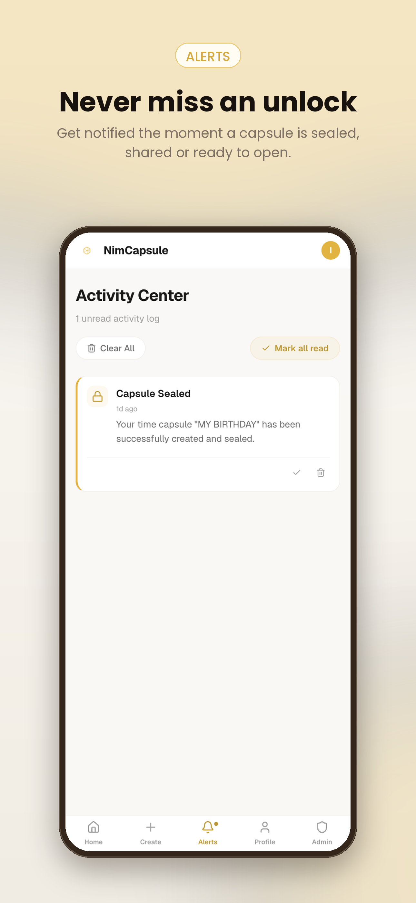

# Nimcapsule

> Lock a moment, Unlock a Gift

| Field | Value |
| --- | --- |
| Category | Creator tools |
| Pricing | Free |
| Team name | ACE TEAM |
| Team members | OLOBA ONYECHERIE, MOSES AYOMIDE, PETER-OSAMOR ISAAC.C |
| X account | https://x.com/NimCapsule |
| Contact email | isaacchukwuka67@gmail.com |
| GitHub login | @OSAMOR19 |
| Submitted at | 2026-07-29T14:34:36.850Z |

## Links

| Link | URL |
| --- | --- |
| Repo | [https://github.com/OSAMOR19/memoryvault.git](<https://github.com/OSAMOR19/memoryvault.git>) |
| Demo | [https://nimcapsule.xyz](<https://nimcapsule.xyz>) |
| Video | [https://x.com/nimcapsule/status/2082462368538214822](<https://x.com/nimcapsule/status/2082462368538214822>) |

## Description

NimCapsule is a digital time capsule platform that lets you preserve life's most meaningful moments and deliver them exactly when they matter most.

Write a heartfelt message. Attach your favorite photos. Set a future unlock date. And if you want to make it truly unforgettable,

## Builder story

It started with a forgotten birthday. Not the kind where you forget to buy a cake  the kind where you find a voice note from someone you lost, buried in an old phone, dated the day before your birthday. They'd recorded it months in advance, knowing they might not be around. But the phone died. 

The note was never heard. The moment passed. That hit different. We sat with that for a while. And then the question wouldn't leave us alone:  What if there was a way to make sure a message always arrives  no matter what? A way to seal something today and guarantee it opens tomorrow, next year, or ten years from now. Not stored in a phone that breaks. Not lost in a cloud folder no one checks. But locked, waiting, and delivered exactly when it's supposed to be. That's where NimCapsule was born. 

 Why Time Capsules? Why Now? We live in an age of instant everything. Instant messages, instant reactions, instant gratification. But the most powerful moments in life aren't instant  they're the ones that arrive with weight. A letter you wrote a year ago. A photo from a night you almost forgot. A gift that shows up on a day when someone needs it most. We wanted to build something that brought intention back to how we communicate. Not another messaging app. Not another social feed. Something slower. Something deliberate. Something that says: I thought about you not just right now, but months ago, when I sealed this for you. 

Why Crypto? Why NIM? We could have stopped at messages and photos. But we kept asking: *What if a capsule could carry real value?* Imagine opening a time capsule on your 18th birthday and finding not just a letter from your parents but a crypto gift they locked away years ago. That's not just sentiment. That's someone investing in your future, literally. Nimiq made this possible. It's lightweight, browser-native, and built for exactly this kind of seamless, human-first experience. 

No complicated wallet setups. No gas fee headaches. Just connect, attach, and seal.What We Believe We believe memories deserve more than a camera roll. We believe some words are meant to arrive later. We believe gifts carry more meaning when they're tied to a moment in time. NimCapsule isn't just an app. It's a promise that the things you care about today will still find their way to the people who matter, exactly when they're meant to. **We're not building for likes. We're building for the moments that actually matter.

## Thumbnail

## Screenshots

---

_Generated from the submission form. `submission.yaml` in this folder is the machine-readable source of truth._
