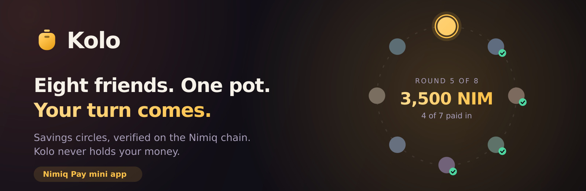
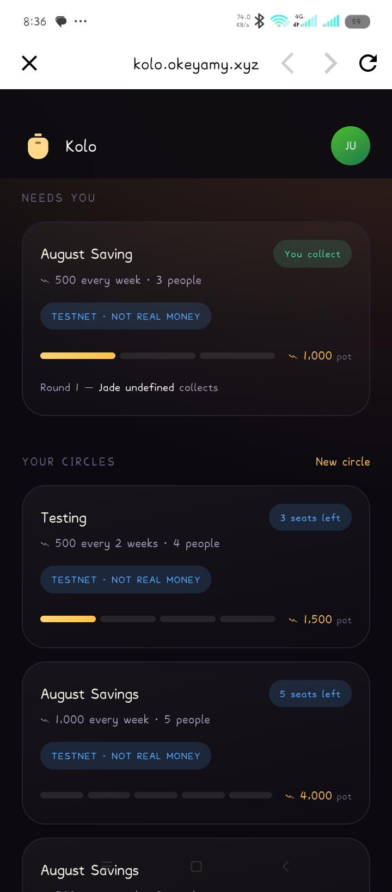
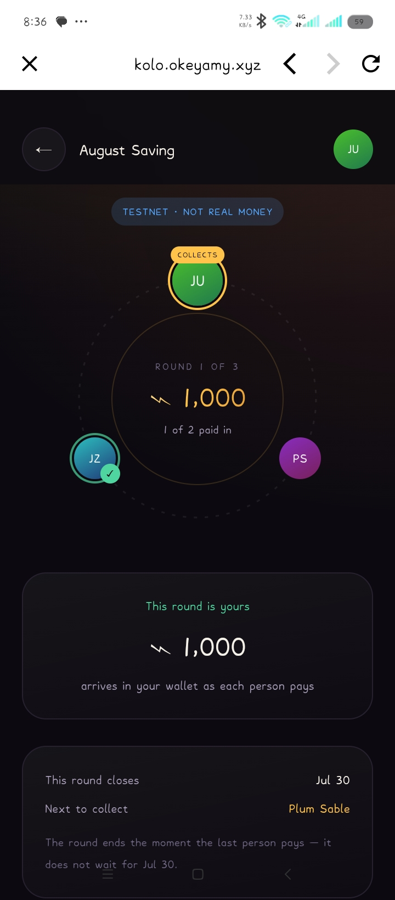
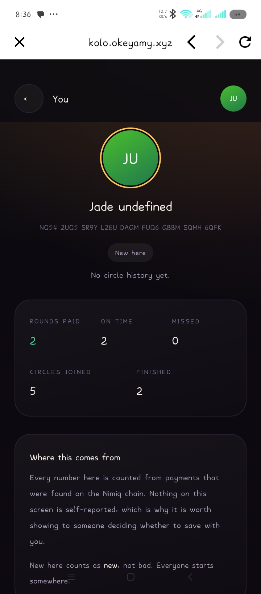

# Kolo

> Your circle saves together. Nimiq makes it trustless.

| Field | Value |
| --- | --- |
| Category | Productivity |
| Pricing | Free |
| Team name | _Not provided — optional_ |
| Team members | _Not provided — optional_ |
| X account | _Not provided — optional_ |
| Contact email | amaobiokeoma@gmail.com |
| GitHub login | @OkeyAmy |
| Submitted at | 2026-07-30T07:40:02.850Z |

## Links

| Link | URL |
| --- | --- |
| Repo | [https://github.com/OkeyAmy/kolo](<https://github.com/OkeyAmy/kolo>) |
| Demo | [https://kolo.okeyamy.xyz/](<https://kolo.okeyamy.xyz/>) |
| Video | [https://youtube.com/shorts/luO6z1H69rY?feature=share](<https://youtube.com/shorts/luO6z1H69rY?feature=share>) |

## Description

Eight people. Twenty dollars a week. One person collects the full pot each round until everyone has had their turn. No bank. No middleman. No one person holding everyone else's money.
This is how hundreds of millions of people outside formal banking already save. It runs on tru

## Builder story

I grew up watching my mum run a "cooperative" with her market trader friends. Every Friday, nine women pooled their week and one person walked away with enough to restock, pay school fees, or fix something that had been broken for months. It worked because they all lived on the same street and could find each other.

The same practice exists in Nigeria as "ajo," in Ghana as "susu," across West Africa, South Asia, and Latin America under dozens of names. Hundreds of millions of people use it. None of them have a way to do it with someone they met online, or someone who moved to another city.
I built Kolo because the coordination problem is solved. Nimiq handles the trust. The memo field on every transaction is the receipt your mum's friends never had.

## Thumbnail

## Screenshots

---

_Generated from the submission form. `submission.yaml` in this folder is the machine-readable source of truth._
