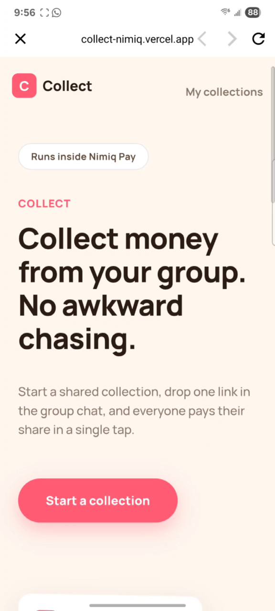
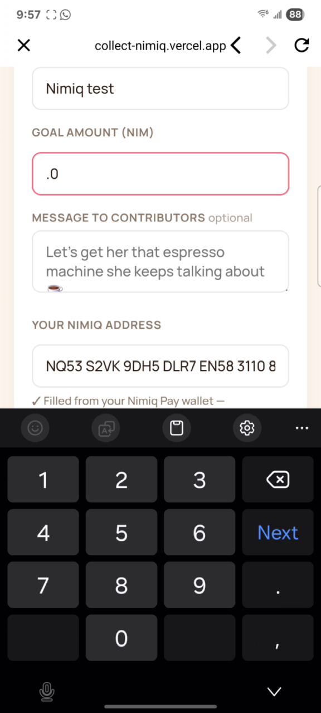
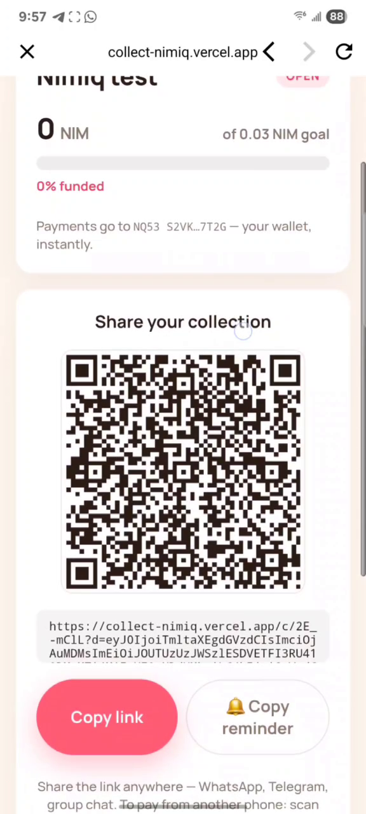
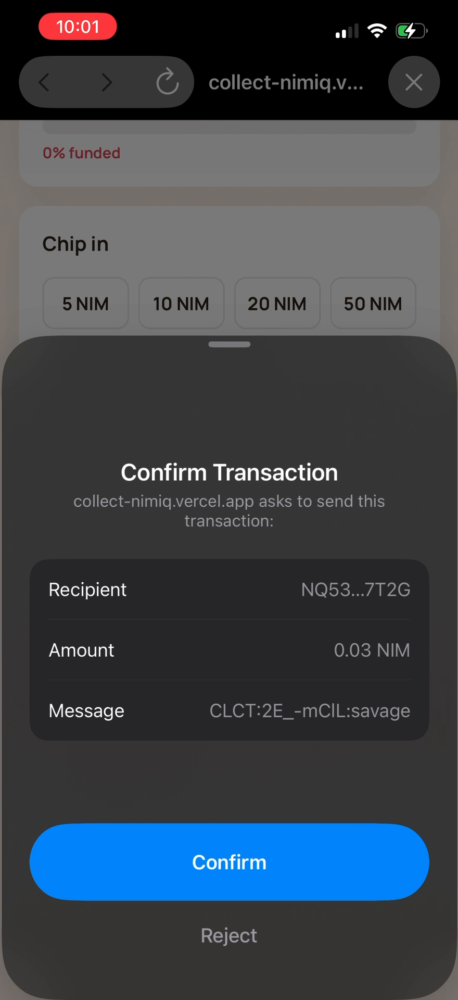
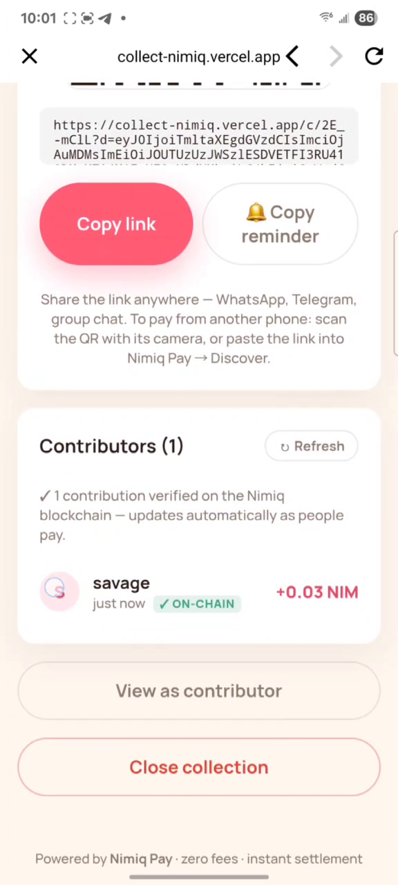

# Collect

> One link. Everyone chips in. No accounts, no fees, no chasing.

| Field | Value |
| --- | --- |
| Category | Social |
| Pricing | Free |
| Team name | _Not provided — optional_ |
| Team members | _Not provided — optional_ |
| X account | savage27z |
| Contact email | savage27zzz@gmail.com |
| GitHub login | @Savage27z |
| Submitted at | 2026-07-30T22:08:17.424Z |

## Links

| Link | URL |
| --- | --- |
| Repo | [https://github.com/Savage27z/Collect](<https://github.com/Savage27z/Collect>) |
| Demo | [https://collect-nimiq.vercel.app](<https://collect-nimiq.vercel.app>) |
| Video | [https://youtube.com/shorts/phzDH0kxaCM?feature=share](<https://youtube.com/shorts/phzDH0kxaCM?feature=share>) |

## Description

Collect turns a group gift into one shareable link, everyone pays their share in a single tap inside Nimiq Pay. No backend: contributions are read straight off the Nimiq blockchain, so they can't be faked.

## Builder story

Everyone has been in the group chat where one person fronts the money for a gift
and then spends two weeks chasing everybody for their share. It's a small problem,
but it's constant, and every reminder costs a little goodwill.

The existing options all add friction — accounts, friend requests, fees, and a
manual tally of who paid sitting in someone's notes app. Nimiq Pay removes most of
that: the payer needs no account, settlement is instant, and fees are negligible.

The first version I built stored everything locally, and it looked fine until I
tested it on two phones. The organiser's dashboard showed nothing, because the
contribution only ever existed on the payer's device. That was the moment the
project got interesting.

The fix was to stop pretending I needed a backend. Every contribution is already a
real Nimiq transaction, so I tag each one in the transaction's data field and read
them back off the chain. Now every device sees the same truth, and nobody can claim
a payment they never made.

## Thumbnail

## Screenshots

---

_Generated from the submission form. `submission.yaml` in this folder is the machine-readable source of truth._
