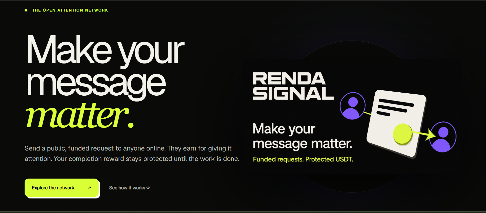
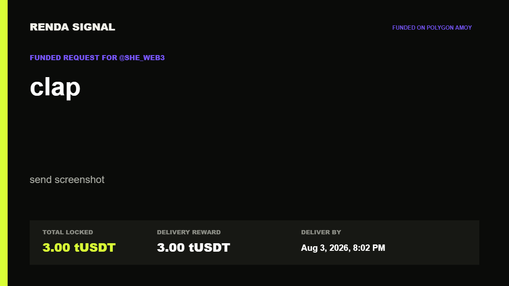
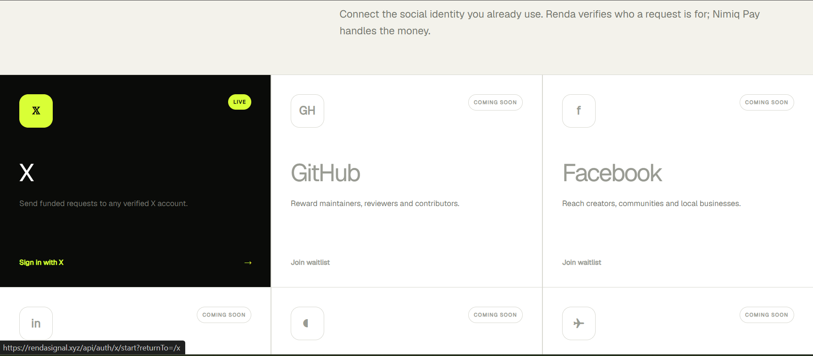

# Renda Signal

> Make your message matter.

| Field | Value |
| --- | --- |
| Category | Marketplaces |
| Pricing | Free |
| Team name | _Not provided — optional_ |
| Team members | _Not provided — optional_ |
| X account | Sandsk1n |
| Contact email | nsomiari@gmail.com |
| GitHub login | @Sheen223 |
| Submitted at | 2026-07-30T01:12:23.493Z |

## Links

| Link | URL |
| --- | --- |
| Repo | [https://github.com/Sheen223/Renda-Signal](<https://github.com/Sheen223/Renda-Signal>) |
| Demo | [https://rendasignal.xyz](<https://rendasignal.xyz>) |
| Video | [https://youtu.be/jQBXfb57l8E?si=TGdOxj7QnUlK4qff](<https://youtu.be/jQBXfb57l8E?si=TGdOxj7QnUlK4qff>) |

## Description

Send funded requests to anyone on X, with visible payment and protected delivery. Recipients get paid when the requested work is completed.

## Builder story

As a builder, I often need help from other builders. Whether it’s technical advice or honest feedback on a project. But getting someone’s attention is difficult, especially when everyone is busy.

I built Renda Signal so I can show that I genuinely value their time by putting real money behind my request. It turns a cold ask into a clear, funded offer and makes valuable feedback worth responding to.

## Thumbnail

## Screenshots

---

_Generated from the submission form. `submission.yaml` in this folder is the machine-readable source of truth._
