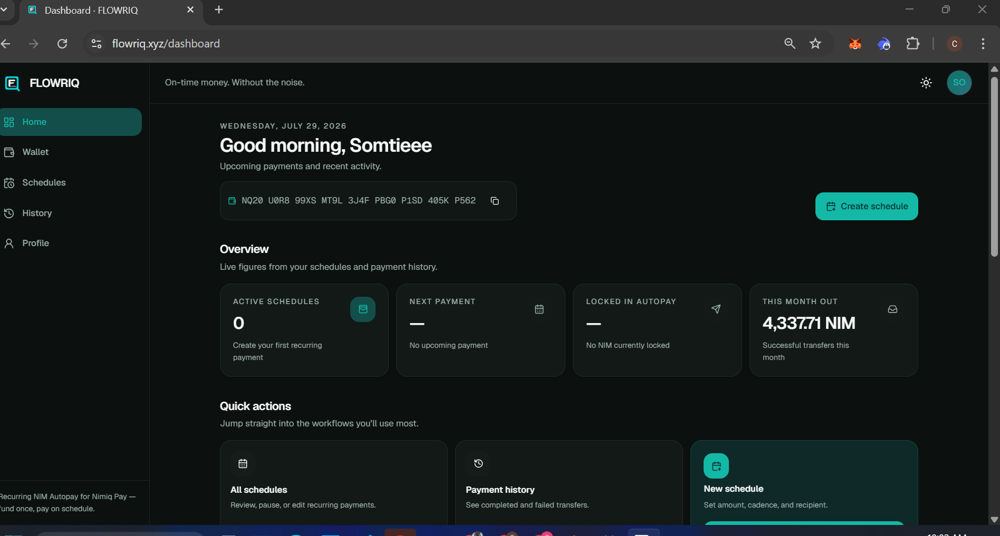
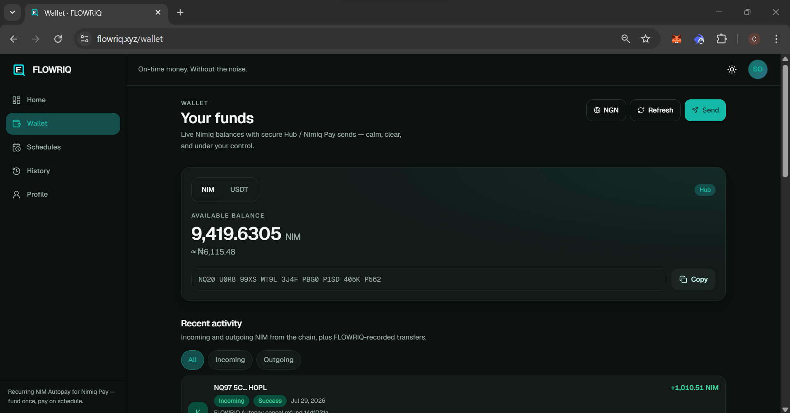
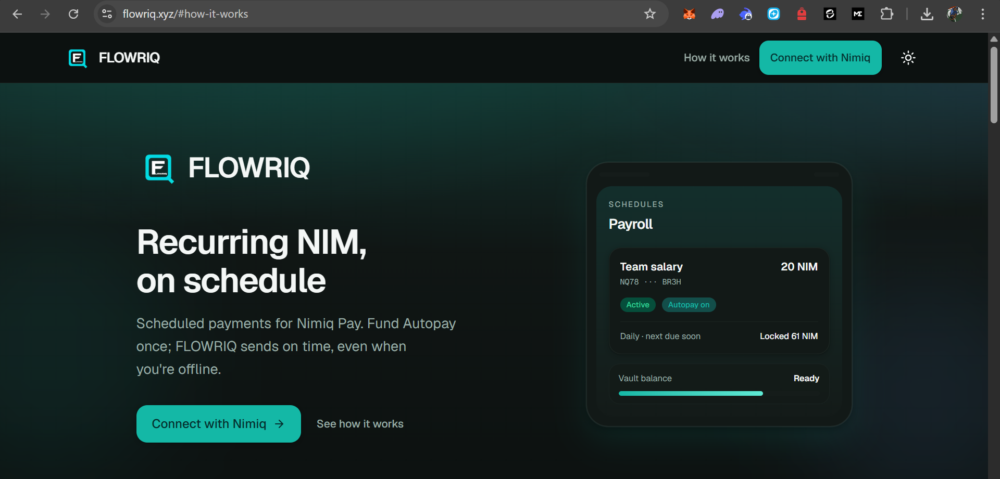
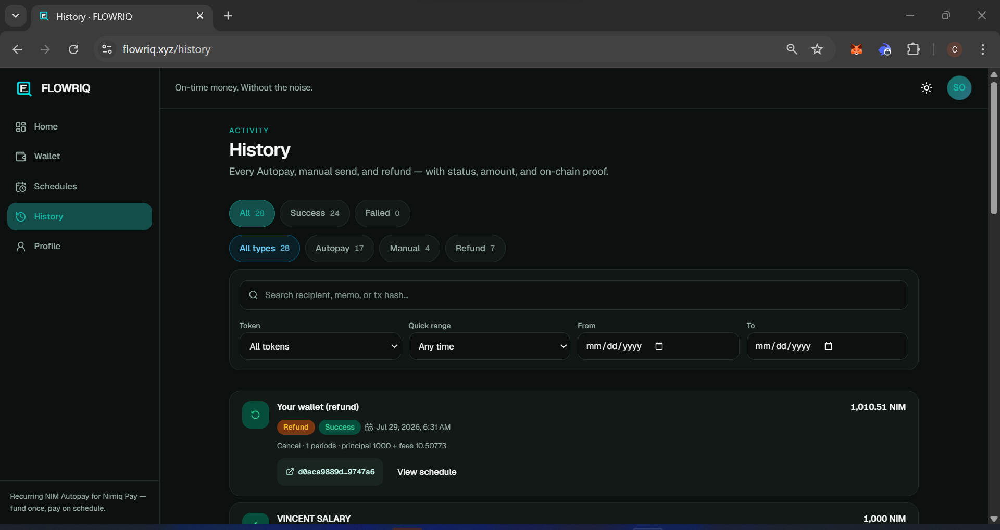
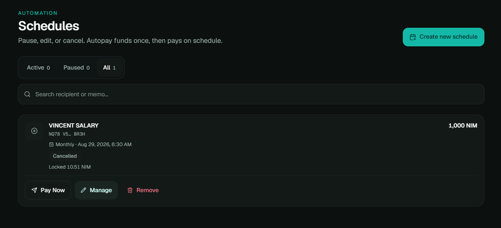

# FLOWRIQ

> Automated recurring payments on Nimiq

| Field | Value |
| --- | --- |
| Category | Productivity |
| Pricing | Free |
| Team name | _Not provided — optional_ |
| Team members | @XdiamondOgodin1 |
| X account | 0xVincentee |
| Contact email | Somtochukwuogodinma@gmail.com |
| GitHub login | @Somtiee |
| Submitted at | 2026-07-29T09:04:33.585Z |

## Links

| Link | URL |
| --- | --- |
| Repo | [https://github.com/Somtiee/FLOWRIQ](<https://github.com/Somtiee/FLOWRIQ>) |
| Demo | [https://www.flowriq.xyz/](<https://www.flowriq.xyz/>) |
| Video | [https://x.com/0xVincentee/status/2082351003001639253?s=20](<https://x.com/0xVincentee/status/2082351003001639253?s=20>) |

## Description

FLOWRIQ is a native Nimiq Mini App that lets you schedule recurring crypto payments once and have them execute automatically even when you’re offline. It supports NIM and USDT, connects seamlessly with the Nimiq wallet, and gives you full control to manage every payment with ease

## Builder story

I built FLOWRIQ out of personal frustration with how underdeveloped recurring payments still are in crypto.

While crypto has made it easy to send money across borders quickly and without traditional banks, almost every wallet still treats payments as one-off actions. If you need to send money every month; whether it’s rent, supporting family, paying a retainer, paying for subscriptions or covering shared expenses; you still have to remember to open your wallet, copy the address, enter the amount and confirm the transaction every single time. It’s easy to forget and it creates unnecessary stress.

I wanted a better solution. Something where you could set the payment once, fund it and let it run automatically without needing to be online or open the app every time the payment is due.

That idea became FLOWRIQ. I designed it as a native Nimiq Mini App so it could integrate deeply with the Nimiq wallet and ecosystem. The goal was to make recurring crypto payments feel as reliable and effortless as they should be in 2026; simple to set up, dependable in execution and built for real life rather than just technical demos.

## Thumbnail

## Screenshots

---

_Generated from the submission form. `submission.yaml` in this folder is the machine-readable source of truth._
