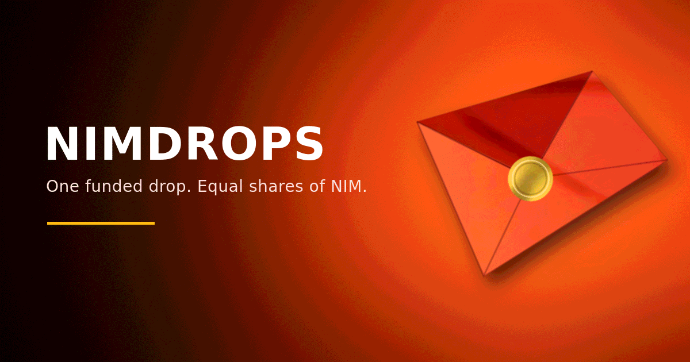
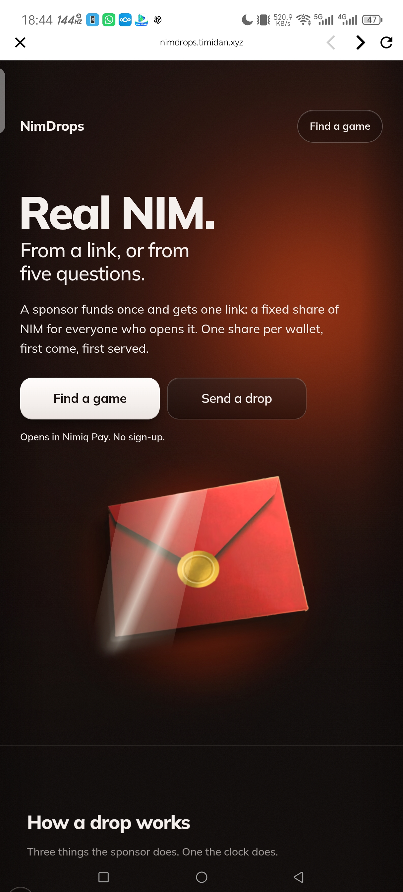
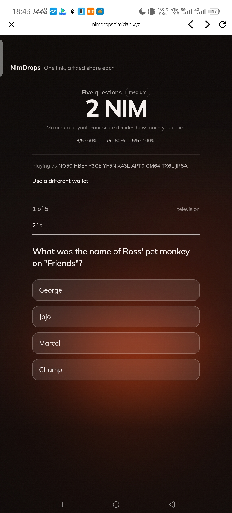
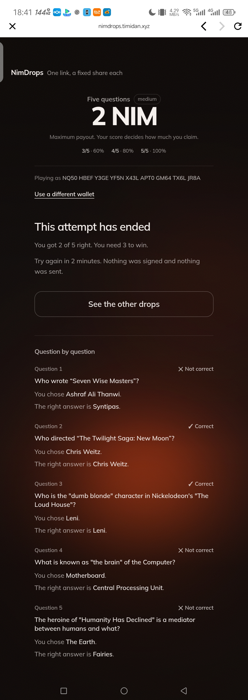
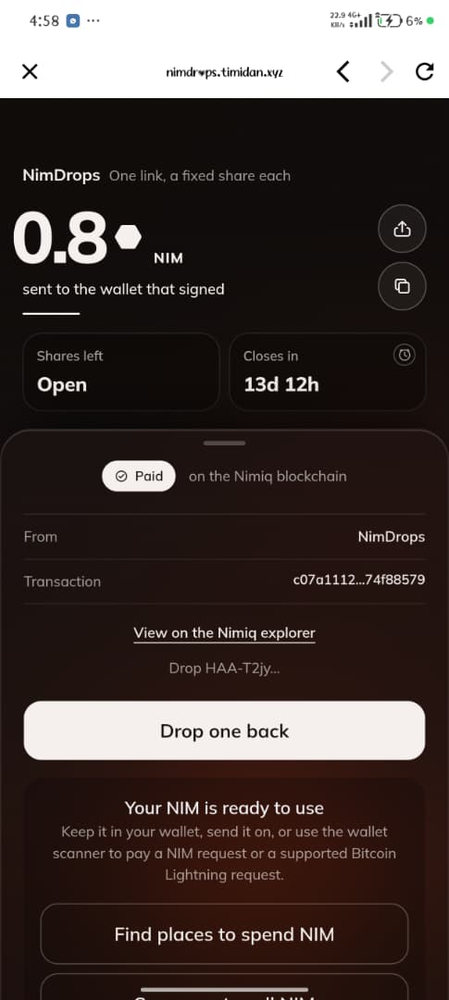
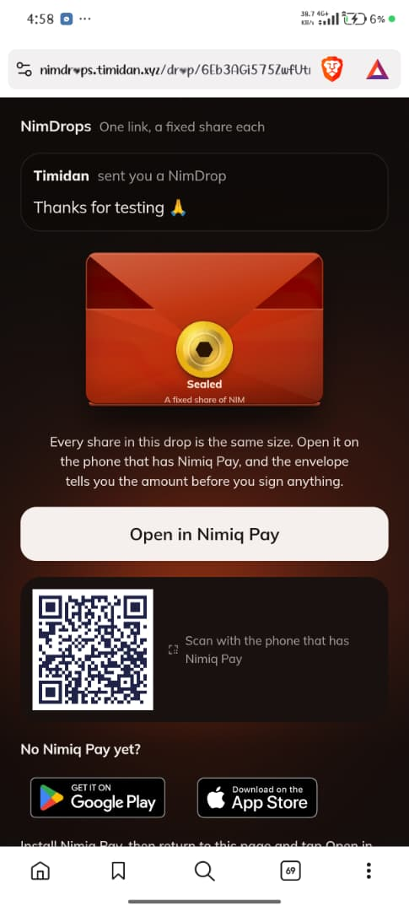

# NimDrops

> Send NIM.Earn NIM.  Share the moment.

| Field | Value |
| --- | --- |
| Category | Earning |
| Pricing | Free |
| Team name | _Not provided — optional_ |
| Team members | _Not provided — optional_ |
| X account | Timidan_x |
| Contact email | timidanx@gmail.com |
| GitHub login | @Timidan |
| Submitted at | 2026-07-29T21:32:35.195Z |

## Links

| Link | URL |
| --- | --- |
| Repo | [https://github.com/Timidan/nimdrops](<https://github.com/Timidan/nimdrops>) |
| Demo | [https://nimdrops.timidan.xyz](<https://nimdrops.timidan.xyz>) |
| Video | [https://youtu.be/0Tjq5Cdts-E](<https://youtu.be/0Tjq5Cdts-E>) |

## Description

Create a red packet, fund it with NIM, and share one link so friends can claim rewards directly into Nimiq Pay. Newcomers can also earn their first NIM through skill-based trivia drops.

## Builder story

I built NimDrops because sending crypto often feels cold and difficult. You copy an address, check it several times, and hope you made no mistake. That does not feel like giving someone a gift.
I took inspiration from WeChat red packets. They turn money into a shared moment. One person sends a packet, others open it, and everyone knows what to do.
I wanted NIM to feel that easy. With NimDrops, you fund a packet and share one link. Friends open it and claim NIM in Nimiq Pay. They do not need to copy an address. Trivia also gives new users a way to earn their first NIM through knowledge, not chance.
I built the app alone in five days. Nimiq requires users to approve wallet actions and does not support the smart contracts this app would usually use. I used a custody wallet with clear notices, signed claims, expiry refunds, and on-chain receipts. Each reward can only be claimed once.
My goal is to help more people receive their first NIM and give them a reason to share it with someone else.

## Thumbnail

## Screenshots

---

_Generated from the submission form. `submission.yaml` in this folder is the machine-readable source of truth._
