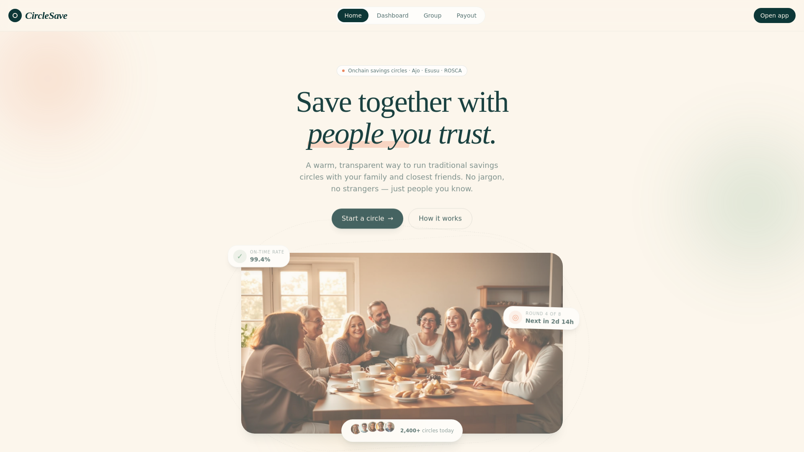
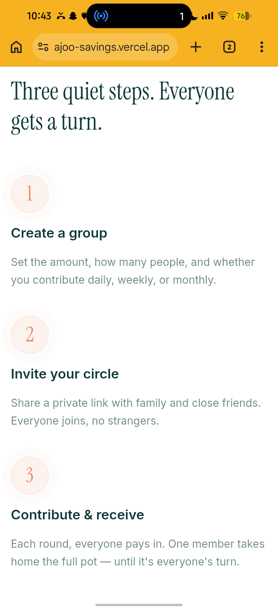
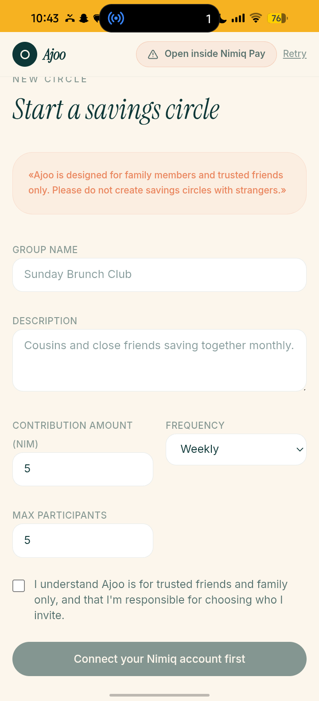

# Ajoo Savings

> Save to Earn

| Field | Value |
| --- | --- |
| Category | Earning |
| Pricing | Free |
| Team name | Yagami |
| Team members | _Not provided — optional_ |
| X account | Coxo52534 |
| Contact email | nifexagbeni@gmail.com |
| GitHub login | @YAGAMI1610 |
| Submitted at | 2026-07-29T09:44:15.871Z |

## Links

| Link | URL |
| --- | --- |
| Repo | [https://github.com/YAGAMI1610/Ajoo-savings](<https://github.com/YAGAMI1610/Ajoo-savings>) |
| Demo | [https://ajoo-savings.vercel.app/](<https://ajoo-savings.vercel.app/>) |
| Video | [https://youtu.be/D3OwyHIN800?si=vt_ojf-JCCSG1ayL](<https://youtu.be/D3OwyHIN800?si=vt_ojf-JCCSG1ayL>) |

## Description

A savings circle built into the NimPay App that helps people save together to reach a shared goal.

## Builder story

_Not provided — optional_

## Thumbnail

## Screenshots

---

_Generated from the submission form. `submission.yaml` in this folder is the machine-readable source of truth._
