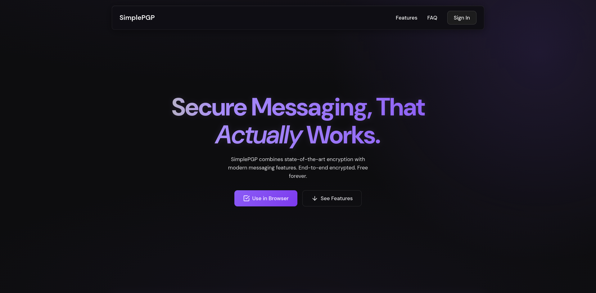
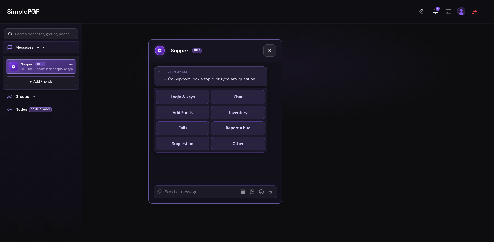
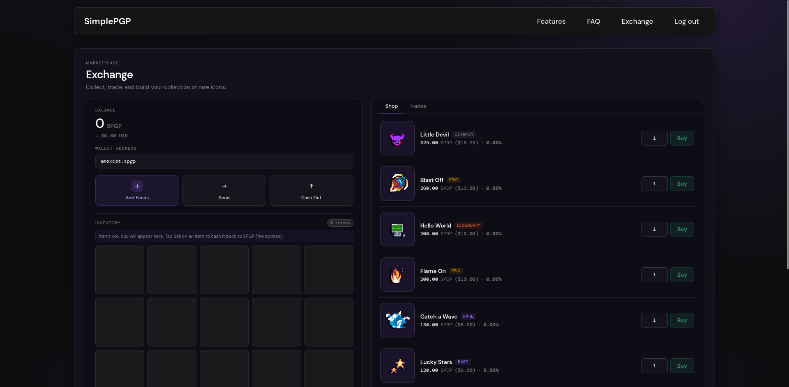
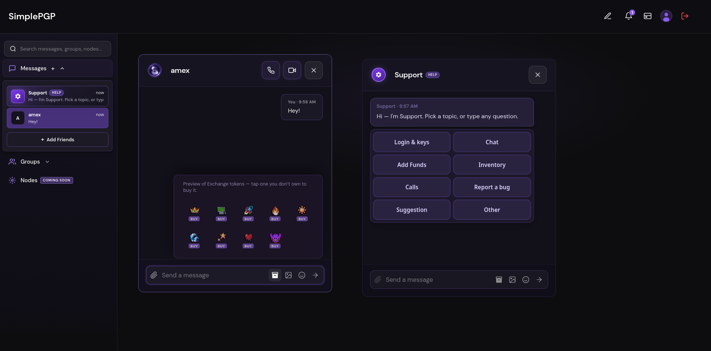

# SimplePGP

> Encrypted Messaging Platform

| Field | Value |
| --- | --- |
| Category | Social |
| Pricing | Free |
| Team name | SimplePGP |
| Team members | _Not provided — optional_ |
| X account | _Not provided — optional_ |
| Contact email | royrafusemika@gmail.com |
| GitHub login | @amexrip |
| Submitted at | 2026-07-29T13:59:29.301Z |

## Links

| Link | URL |
| --- | --- |
| Repo | [https://github.com/amexrip/SimplePGP](<https://github.com/amexrip/SimplePGP>) |
| Demo | [https://simplepgp.org/](<https://simplepgp.org/>) |
| Video | [https://vimeo.com/1213921964?share=copy&fl=sv&fe=ci](<https://vimeo.com/1213921964?share=copy&fl=sv&fe=ci>) |

## Description

On SimplePGP you can message your friends securely using PGP encryption and you can trade with them aswell!

## Builder story

_Not provided — optional_

## Thumbnail

## Screenshots

---

_Generated from the submission form. `submission.yaml` in this folder is the machine-readable source of truth._
