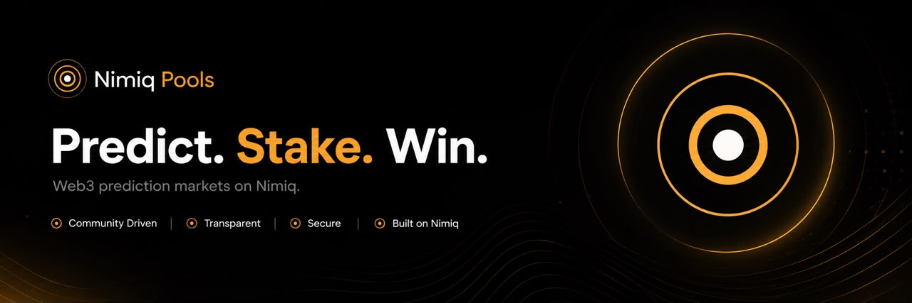
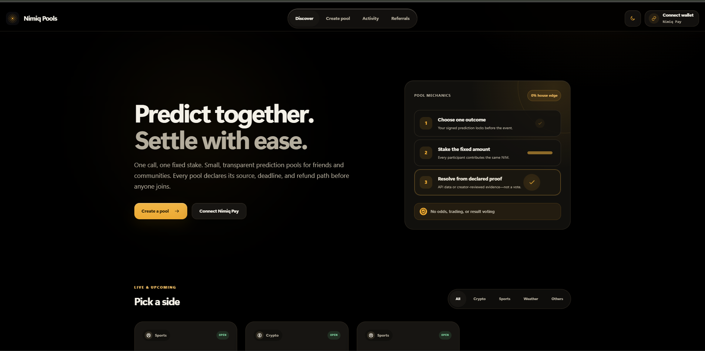
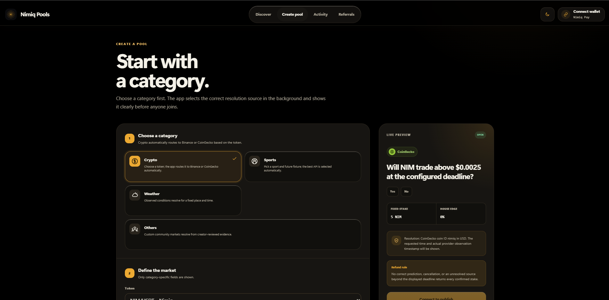
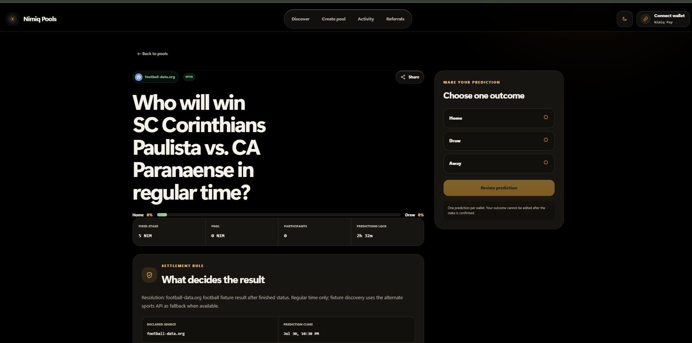

# Nimiq Pools

> Predict together. Settle with ease.

| Field | Value |
| --- | --- |
| Category | Earning |
| Pricing | Free |
| Team name | _Not provided — optional_ |
| Team members | Azeez |
| X account | nimiqpools |
| Contact email | adeyeleenoch01@gmail.com |
| GitHub login | @dammygreene |
| Submitted at | 2026-07-30T19:01:50.009Z |

## Links

| Link | URL |
| --- | --- |
| Repo | [https://github.com/dammygreene/NimiqPools](<https://github.com/dammygreene/NimiqPools>) |
| Demo | [https://nimiqpools.xyz/](<https://nimiqpools.xyz/>) |
| Video | [https://x.com/NimiqPools/status/2082902731648319652](<https://x.com/NimiqPools/status/2082902731648319652>) |

## Description

Nimiq Pools is a social prediction platform inside Nimiq Pay where friends and communities create prediction pools, stake NIM, and receive automatic or community-verified payouts. It's built for anyone who wants a simple, transparent way to settle real-world predictions.

## Builder story

Like many people, I've lost count of how many times friends have said, "I bet you're wrong," only for everyone to forget about it later. Whether it's crypto price predictions, football matches, or friendly challenges, there's never been a simple way to turn those moments into something transparent and fun.

That's what inspired Nimiq Pools. I wanted to build a lightweight social prediction platform where anyone can create a prediction pool, stake NIM, and have the outcome resolved fairly, either automatically from trusted data sources or by the community itself.

Nimiq's feeless payments and Mini App ecosystem made it possible to create an experience where even small prediction pools feel instant and practical. My goal wasn't to build another betting app, but to make friendly predictions easy to create, easy to settle, and accessible to everyone inside Nimiq Pay.

## Thumbnail

## Screenshots

---

_Generated from the submission form. `submission.yaml` in this folder is the machine-readable source of truth._
