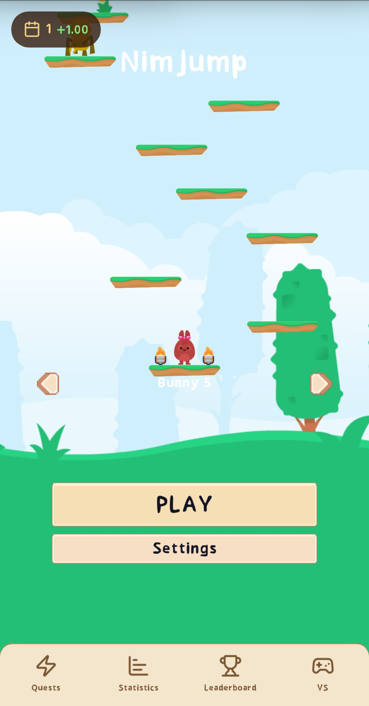
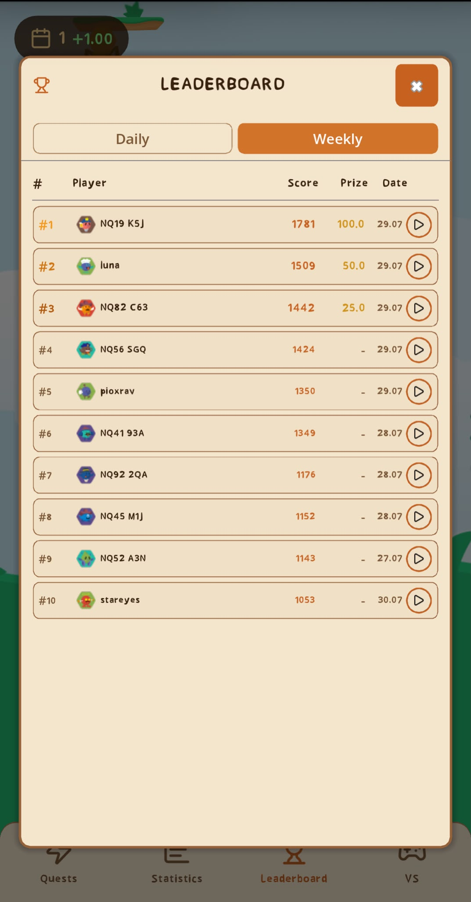
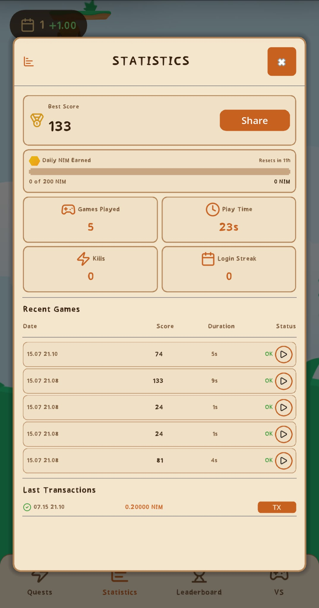
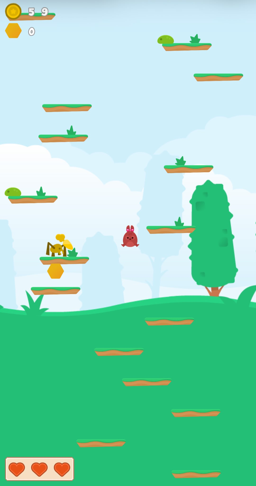
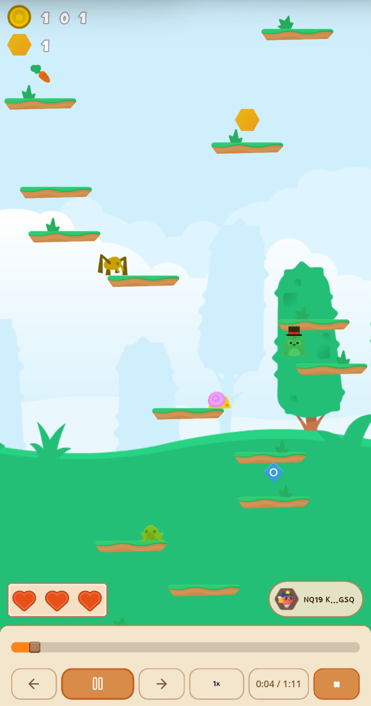

# NimJump

> Solving one of web3 gaming's biggest problems — cheating — wrapped in a game actually worth playing.

| Field | Value |
| --- | --- |
| Category | Games |
| Pricing | Free |
| Team name | _Not provided — optional_ |
| Team members | _Not provided — optional_ |
| X account | NimJump |
| Contact email | emre34altinok@gmail.com |
| GitHub login | @emrealt34 |
| Submitted at | 2026-07-30T11:15:16.955Z |

## Links

| Link | URL |
| --- | --- |
| Repo | [https://github.com/nimjump/game](<https://github.com/nimjump/game>) |
| Demo | [https://nimjump.zetashare.com](<https://nimjump.zetashare.com>) |
| Video | [https://youtube.com/shorts/JklwqY97iUI](<https://youtube.com/shorts/JklwqY97iUI>) |

## Description

NimJump is an endless vertical platformer game for Nimiq — jump, dodge, and climb as high as you can with tap or gyro-tilt controls. Every run is verified server-side: the client only sends its inputs, the backend replays the match itself, and only pays out if the replay matches

## Builder story

I've been doing game development for almost 3 years, and I love web3 games as a player too — that's what made the cheating problem stand out to me: in most "score = money" games, the client claims a score and the backend just takes its word for it. Fixing that structurally is the actual core of NimJump — everything else is built around it. The client has zero authority: it only records raw inputs. The server replays those inputs itself and only trusts its own recomputed result — if it doesn't match exactly, the run is rejected. Every reward (leaderboard rank, quests, coin conversion) is granted purely off that server-side result.

There's also a reward-farming guard: every NIM claim is checked per-IP, max 2 wallets paid per IP per day, so throwaway accounts on one connection don't work.

Recording inputs instead of video also compresses well — a full minute of typical play is around 200 bytes, so under 1GB holds well over 5 million replayable runs. I never have to throw anything away — every leaderboard score has its real replay behind it.

Built in Godot 4.7, with tap or gyroscope tilt controls both supported.

For retention: a daily login streak, daily/weekly leaderboard resets, and daily quests give players a reason to come back each day instead of playing once.

One of the newer additions is VS mode — 1v1 wagered challenges where two players stake NIM, play the same seed, and the higher score takes the pot. It gives NIM real in-game utility (circulating between players, not just paid out one-way), and it turned into an organic growth loop — players stake and send the challenge link directly to friends, pulling new people in through invites instead of ads. Same anti-cheat guarantee applies: both replays are server-verified before payout.

I've been building NimJump since the competition was announced — about a month — and it's been running publicly that whole time, not just tested privately. In the first week, 15 different real users found and played it — by the most recent week, that had grown to a total of 28 users. Full stats published here:
https://www.skool.com/miniappscompetition/nimjump-release
https://www.skool.com/miniappscompetition/nimjump-update
https://www.skool.com/miniappscompetition/nimjump-stats-update-last-post-before-competition

## Thumbnail

## Screenshots

---

_Generated from the submission form. `submission.yaml` in this folder is the machine-readable source of truth._
