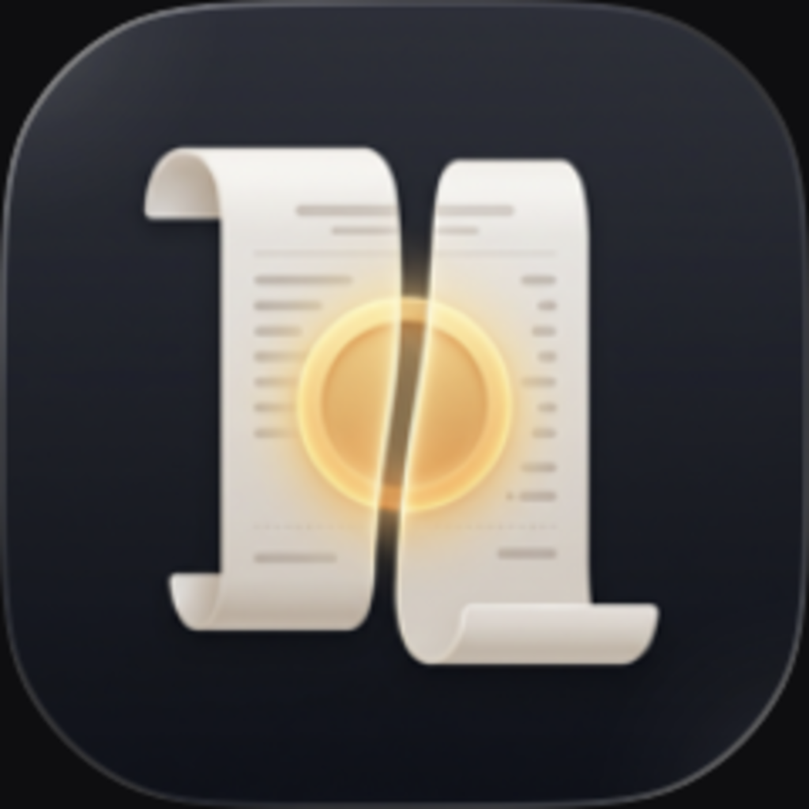
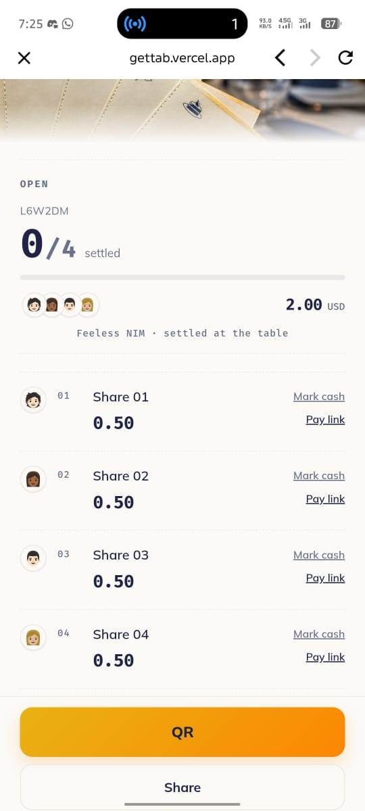
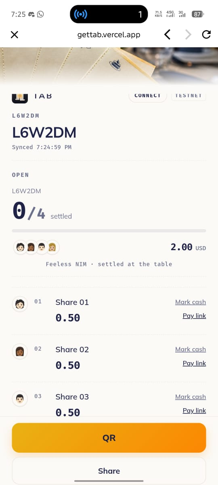
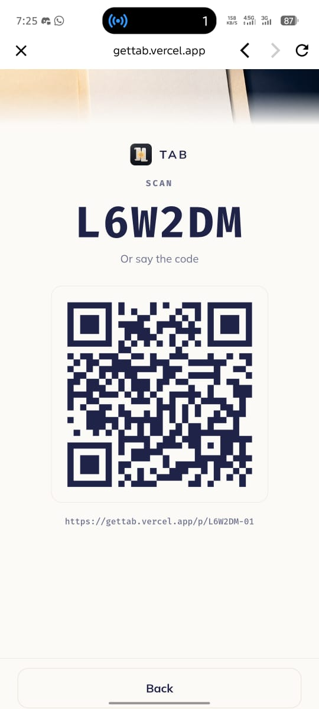

# Tab

> Split a restaurant bill into instant, feeless NIM payment requests with friends

| Field | Value |
| --- | --- |
| Category | Social |
| Pricing | Free |
| Team name | _Not provided — optional_ |
| Team members | _Not provided — optional_ |
| X account | zanbuilds |
| Contact email | ibrahimpima76@gmail.com |
| GitHub login | @fozagtx |
| Submitted at | 2026-07-30T20:06:44.054Z |

## Links

| Link | URL |
| --- | --- |
| Repo | [https://github.com/fozagtx/Tab](<https://github.com/fozagtx/Tab>) |
| Demo | [https://gettab.vercel.app/](<https://gettab.vercel.app/>) |
| Video | [https://vimeo.com/1214371886?share=copy&fl=sv&fe=ci](<https://vimeo.com/1214371886?share=copy&fl=sv&fe=ci>) |

## Description

Split bills with friends by creating instant, feeless NIM payment requests. Everyone gets their share, pays in one tap, and the organizer can track who has paid.

## Builder story

I built Tab to make group payments effortless. Splitting restaurant bills is often slow and awkward, especially when everyone needs to calculate amounts or deal with transfer fees. Tab uses Nimiq's instant, feeless payments to generate payment requests for each participant, making it easy to collect everyone's share in seconds. The goal was to create a simple social payment experience that feels seamless and encourages real-world crypto usage.

## Thumbnail

## Screenshots

---

_Generated from the submission form. `submission.yaml` in this folder is the machine-readable source of truth._
