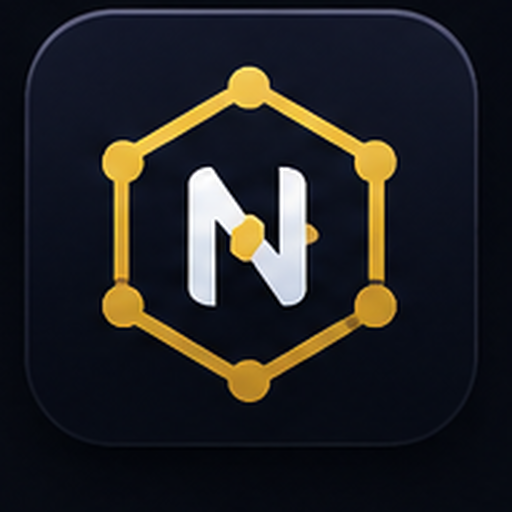
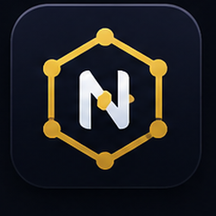
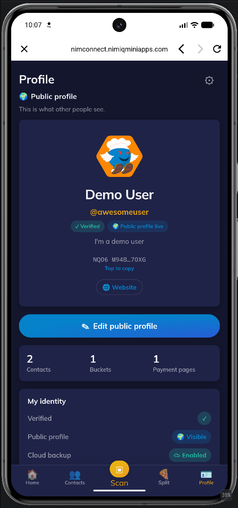
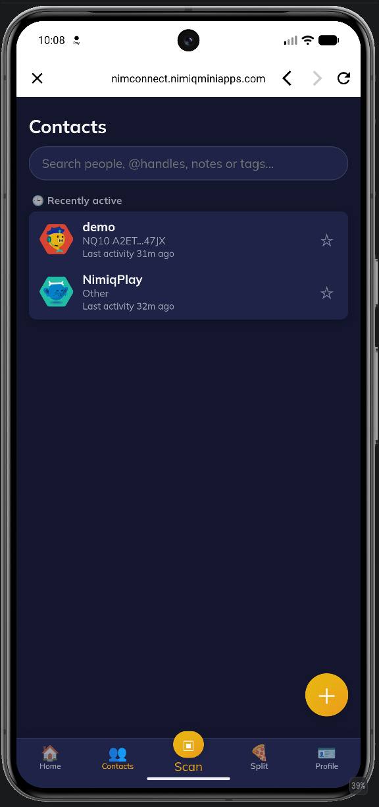
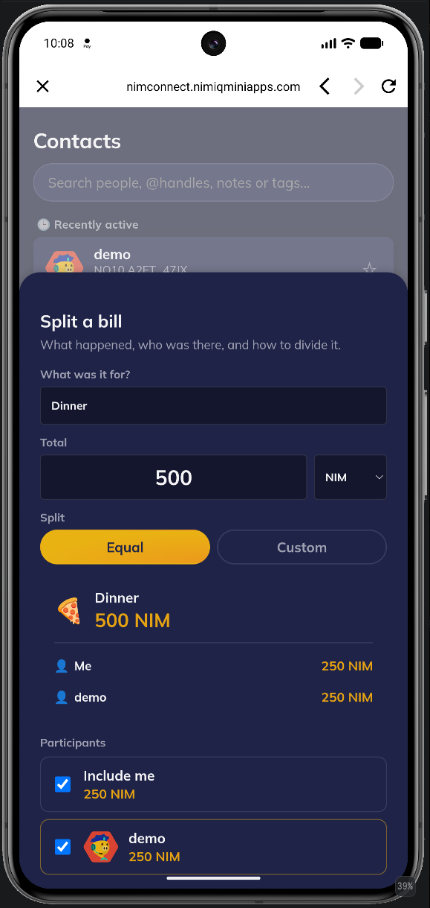
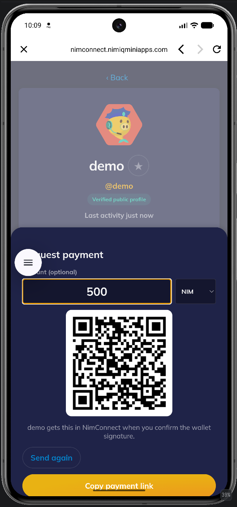

# NimConnect

> Human-friendly crypto starts here.

| Field | Value |
| --- | --- |
| Category | Social |
| Pricing | Free |
| Team name | _Not provided — optional_ |
| Team members | _Not provided — optional_ |
| X account | https://x.com/nimiqminiapps |
| Contact email | meastro@protonmail.com |
| GitHub login | @maestroi |
| Submitted at | 2026-07-26T20:10:56.181Z |

## Links

| Link | URL |
| --- | --- |
| Repo | [https://github.com/NimMiniApps/NimConnect](<https://github.com/NimMiniApps/NimConnect>) |
| Demo | [https://nimconnect.nimiqminiapps.com](<https://nimconnect.nimiqminiapps.com>) |
| Video | [https://www.youtube.com/watch?v=vFwWc2TUGXw](<https://www.youtube.com/watch?v=vFwWc2TUGXw>) |

## Description

NimConnect transforms your wallet into a people-first experience. Claim a permanent @handle, manage contacts, send and request payments, split bills, and use your identity seamlessly across Nimiq Mini Apps.

## Builder story

Crypto wallets are still built around long addresses instead of people. I wanted to create the missing identity layer for the Nimiq ecosystem—a place where users can claim human-readable @handles, manage relationships, and interact with others naturally. NimConnect makes payments feel personal while providing reusable identity infrastructure that any Nimiq Mini App can integrate.

## Thumbnail

## Screenshots

---

_Generated from the submission form. `submission.yaml` in this folder is the machine-readable source of truth._
