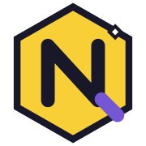
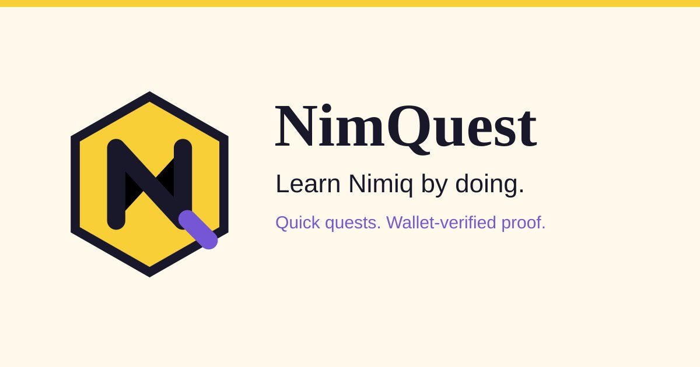
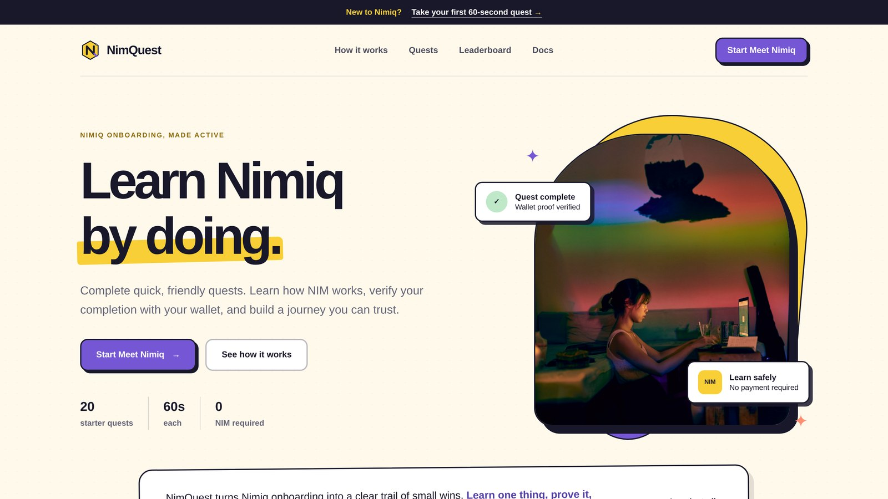
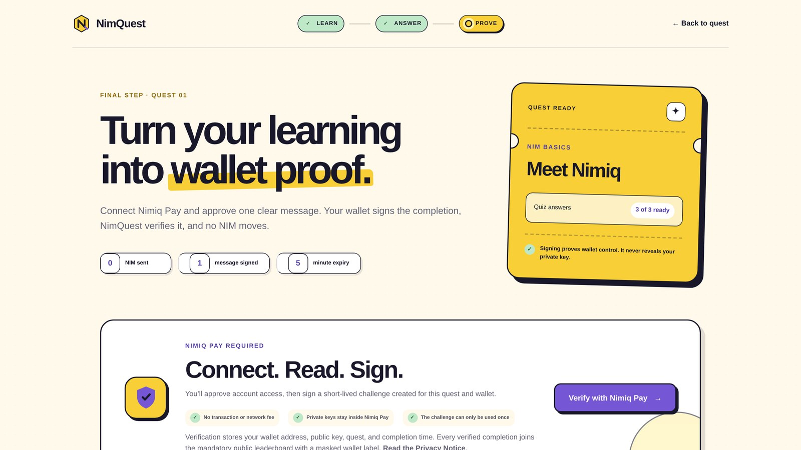
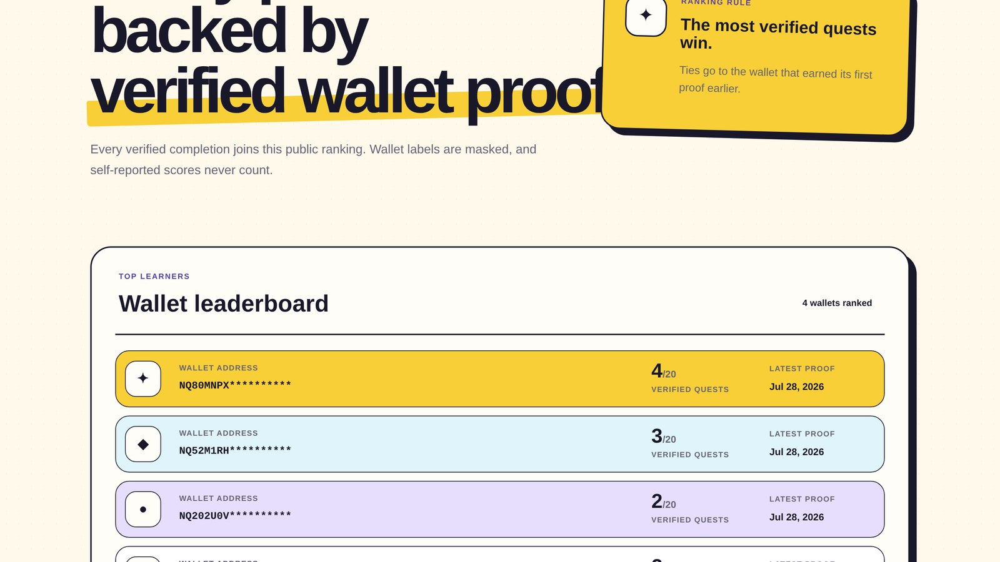
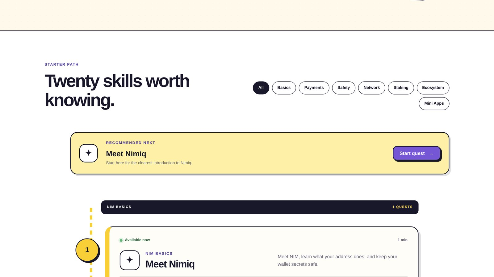

# NimQuest

> Learn Nimiq by doing, then prove you learned it with your own Nimiq wallet.

| Field | Value |
| --- | --- |
| Category | Education |
| Pricing | Free |
| Team name | _Not provided — optional_ |
| Team members | _Not provided — optional_ |
| X account | MystiqueMide |
| Contact email | mide27145@gmail.com |
| GitHub login | @mystiquemide |
| Submitted at | 2026-07-29T07:18:09.598Z |

## Links

| Link | URL |
| --- | --- |
| Repo | [https://github.com/mystiquemide/nimquest](<https://github.com/mystiquemide/nimquest>) |
| Demo | [https://nimquest.artistic-chip.workers.dev](<https://nimquest.artistic-chip.workers.dev>) |
| Video | [https://youtu.be/iSwB3MyyLZM](<https://youtu.be/iSwB3MyyLZM>) |

## Description

NimQuest is a learn-and-prove Nimiq Pay Mini App. Users complete short Nimiq onboarding quests, pass server-graded quizzes, then sign a one-time Nimiq Pay message to create wallet-backed proof of learning without sending NIM. Verified completions are stored as receipts and shown

## Builder story

Every time I onboard to a new chain, the learning is read-only. I skim a docs page, nod, and close the tab with nothing to show I understood any of it. Quizzes that live in the browser are worse, the answers ship in the page and you can cheat in five seconds.

So I built the opposite. You pass a quiz that is graded on the server, then you sign a one-time message with the wallet you actually control. The receipt is the proof. The real receipt so far: one Meet Nimiq completion signed inside Nimiq Pay on an iPhone, stored in D1, visible on the live leaderboard. No NIM moved.

## Thumbnail

## Screenshots

---

_Generated from the submission form. `submission.yaml` in this folder is the machine-readable source of truth._
