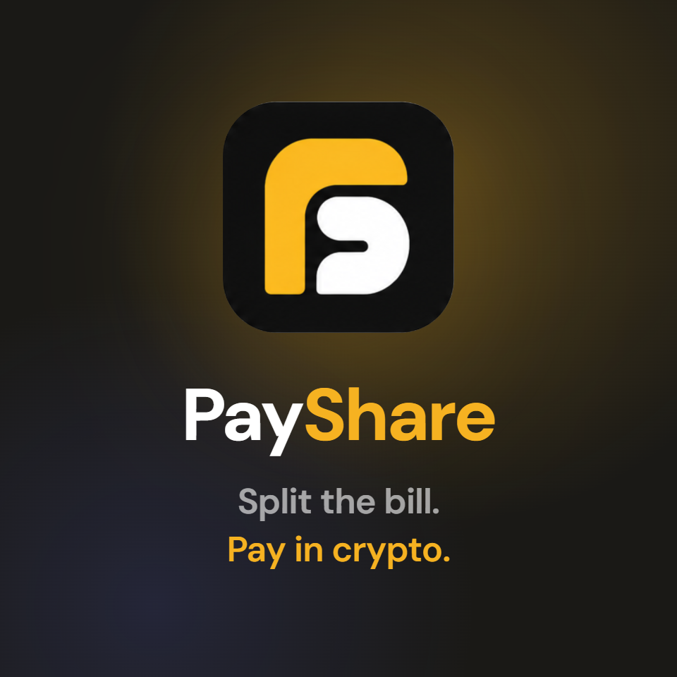
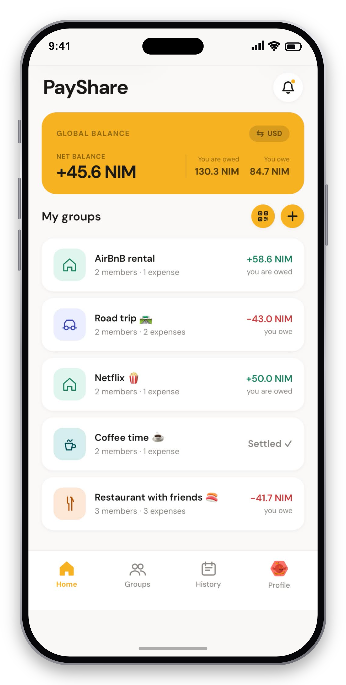
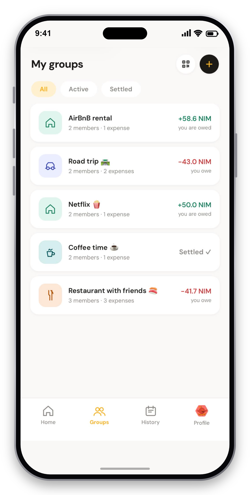
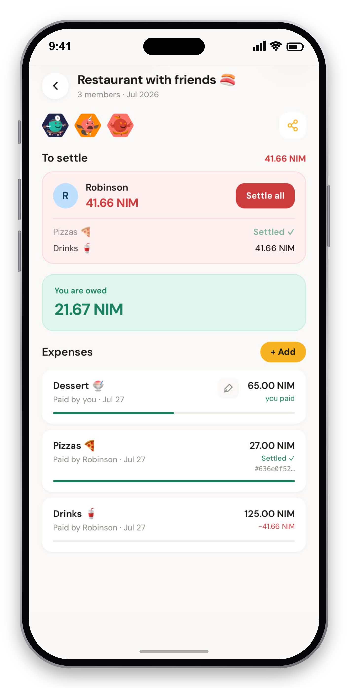
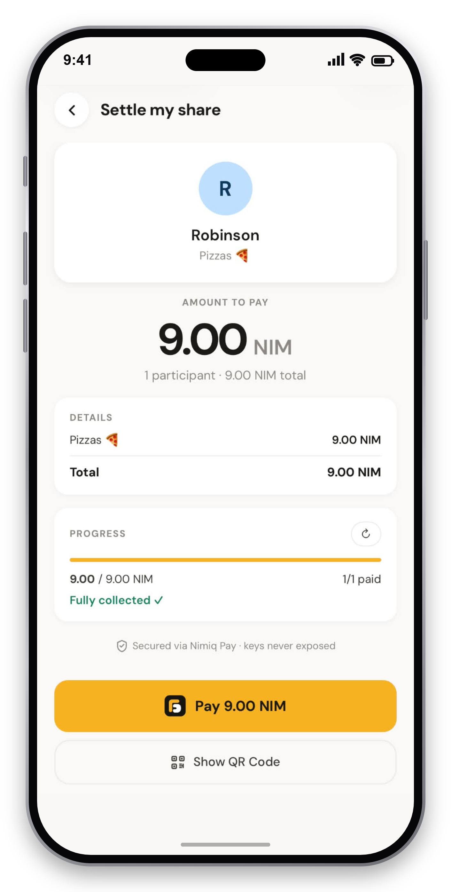

# PayShare

> Split the bill. Pay in crypto.

| Field | Value |
| --- | --- |
| Category | Lifestyle |
| Pricing | Free |
| Team name | PayShare Team |
| Team members | Robinson Barais, Thomas Feuillâtre |
| X account | PayShareApp |
| Contact email | robinson.barais@orange.fr |
| GitHub login | @rbarais |
| Submitted at | 2026-07-28T14:44:27.057Z |

## Links

| Link | URL |
| --- | --- |
| Repo | [https://github.com/rbarais/payshareminiapp](<https://github.com/rbarais/payshareminiapp>) |
| Demo | [https://payshareapp.com/](<https://payshareapp.com/>) |
| Video | [https://youtube.com/shorts/io1YnhPAg18](<https://youtube.com/shorts/io1YnhPAg18>) |

## Description

PayShare turns splitting bills with friends into a one-tap wallet flow: one person pays, PayShare tallies who owes what, and everyone settles up in NIM straight from the group: no accounts, no spreadsheets, no chasing anyone.

## Builder story

Why PayShare?

PayShare was born from a simple situation that we have all experienced at some point.

A dinner with friends, a group weekend, a shared gift, a trip organized with several people… In these situations, there is often one person who pays upfront, followed by the inevitable question of reimbursement. Who owes how much? Who has already paid? Who still needs to send their share?

Today, many applications help simplify expense sharing. They allow users to create groups, add expenses, and automatically calculate each person's share. However, even these solutions still have one major friction point: the reimbursement itself is not always integrated directly into the experience.

Once the expense has been split, users often need to switch to another application, open their banking app, find the right contact, enter an amount, add a beneficiary, or wait for the transfer to be completed. Expense sharing has become easier, but the actual payment remains an additional step.

This is exactly the last step that PayShare aims to remove.

When we wanted to bring this same simplicity to cryptocurrency, we realized that the challenge was even greater. Wallets already allow users to send crypto, but no solution was truly designed for everyday use cases such as reimbursing a friend. Users still had to deal with wallet addresses, verify technical information, or follow a process that was not suited for simple and occasional payments.

This double frustration is what led to the creation of PayShare: simplifying both expense sharing and settlement, within a single seamless experience.

With PayShare, users can create a group, add an expense, invite their friends, and allow everyone to pay their share directly from the application. No more switching between different tools or completing multiple steps: creating the shared expense and settling it happen in the same place.

Our ambition is not to create a new wallet. Wallets already exist and fulfill their purpose. What is still missing today are simple experiences that bring real everyday utility to crypto payments.

PayShare brings a concrete use case to crypto wallets: reimbursing a friend after a restaurant, sharing travel expenses, or contributing to a group gift, with an experience as natural as the traditional payment solutions we already use.

To make this experience possible, we chose to build on the Nimiq ecosystem. Its user-focused approach, fast transactions, low costs, and Mini Apps environment perfectly match our vision: enabling everyone to use cryptocurrency without having to worry about technical complexity.

Because ultimately, users should not have to think about blockchain. They should simply think: "I need to pay my friend back", and complete the payment in just a few seconds.

With PayShare, we want to demonstrate that cryptocurrency can solve real everyday problems. Not by asking users to change their habits, but by naturally integrating into the actions they already perform every day.

- Thomas & Robinson

## Thumbnail

## Screenshots

---

_Generated from the submission form. `submission.yaml` in this folder is the machine-readable source of truth._
