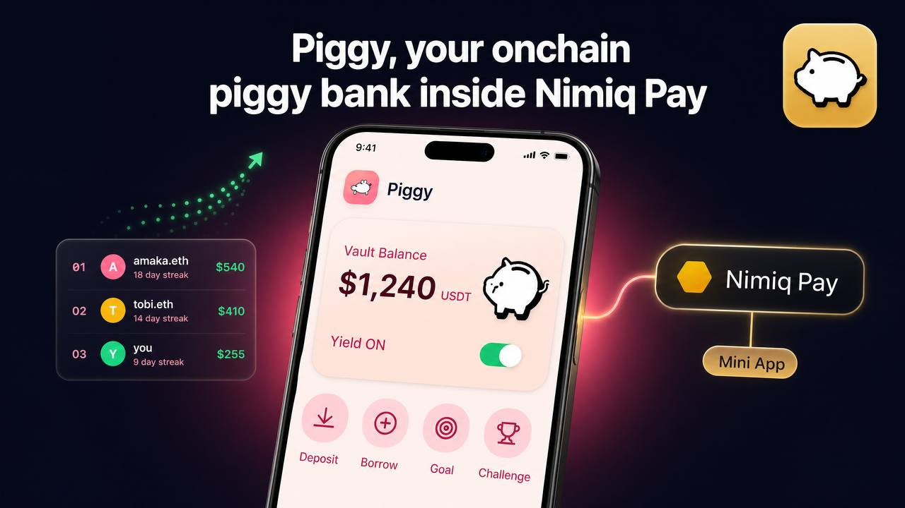
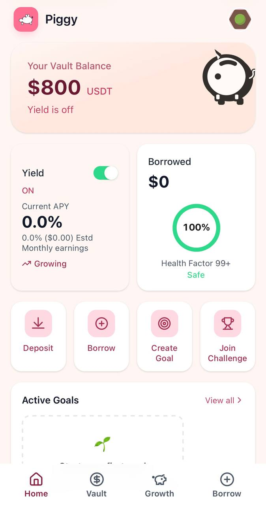
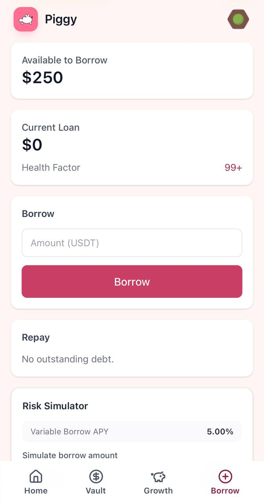
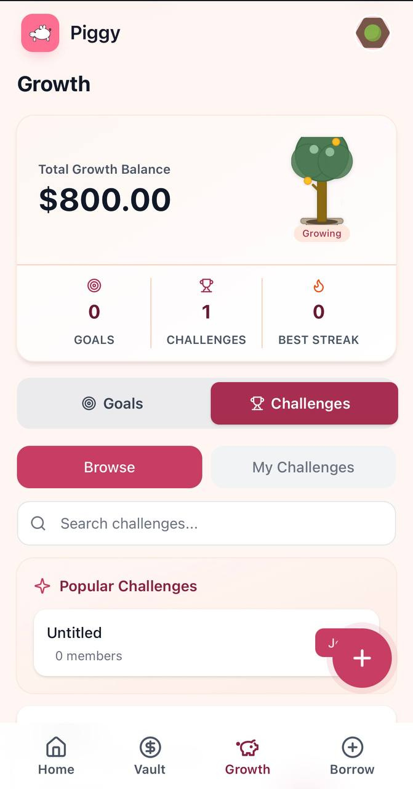

# Piggy

> Your onchain Piggy Bank  on NimiqPay

| Field | Value |
| --- | --- |
| Category | Earning |
| Pricing | Free |
| Team name | tonywtf |
| Team members | tonywtf |
| X account | project: @piggyvault__ , Founder: @tonywtf__ |
| Contact email | roadsidelabinc@gmail.com |
| GitHub login | @roadsidedev |
| Submitted at | 2026-07-30T18:22:56.314Z |

## Links

| Link | URL |
| --- | --- |
| Repo | [https://github.com/roadsidedev/piggy-nimq](<https://github.com/roadsidedev/piggy-nimq>) |
| Demo | [https://piggy-vault.vercel.app/](<https://piggy-vault.vercel.app/>) |
| Video | [https://youtu.be/i6eku_S2rLM?si=tgCs3IZWlaVTVBku](<https://youtu.be/i6eku_S2rLM?si=tgCs3IZWlaVTVBku>) |

## Description

Piggy is a Mini App inside Nimiq Pay that helps you save USDT, optionally earn yield on your savings, borrow when you need cash without breaking your vault, and build strong savings habits with friends

## Builder story

As someone working to improve my savings habits and build real financial independence, I wanted a pocket-friendly piggy bank fit for the digital, onchain age. I wanted a place to save my USDT with ease — no KYC, no bank accounts, no friction. Somewhere I could save as I earn.

So I built Piggy: my onchain piggy bank, inside Nimiq Pay.

We built Piggy to help anyone develop a strong savings culture. Deposit USDT into your vault and optionally earn yield on top. Need cash in an emergency? Borrow against your savings without breaking your vault. To make saving stick, we added Save-with-Frens challenges — join or create challenges like “save $10 every day” and build streaks together. And to help you hit real goals, set targeted vaults for a vacation, a new laptop, or anything else.

No bank apps. No KYC delays. Just your wallet, your vault, and your goals.

## Thumbnail

## Screenshots

---

_Generated from the submission form. `submission.yaml` in this folder is the machine-readable source of truth._
