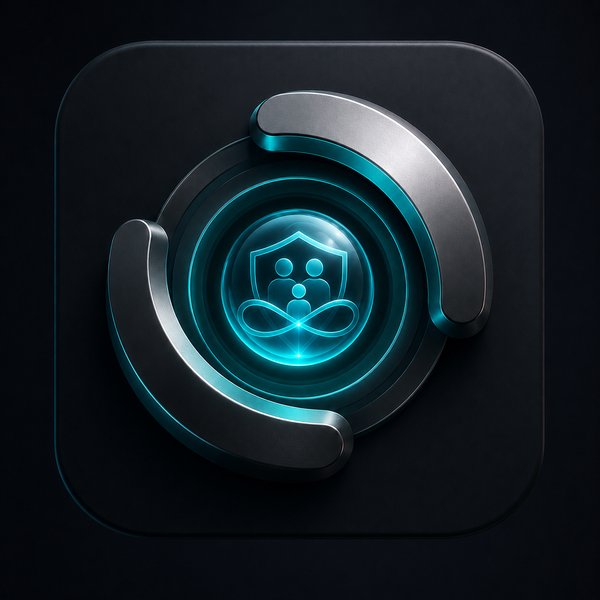
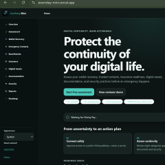
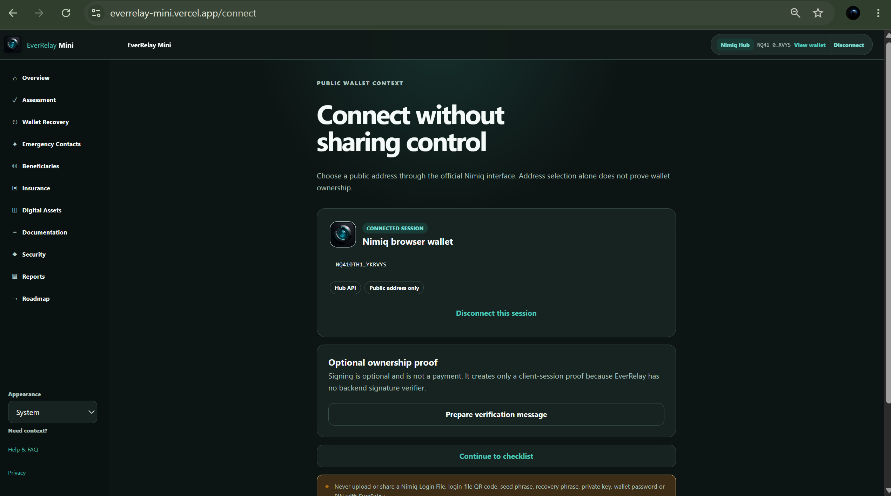
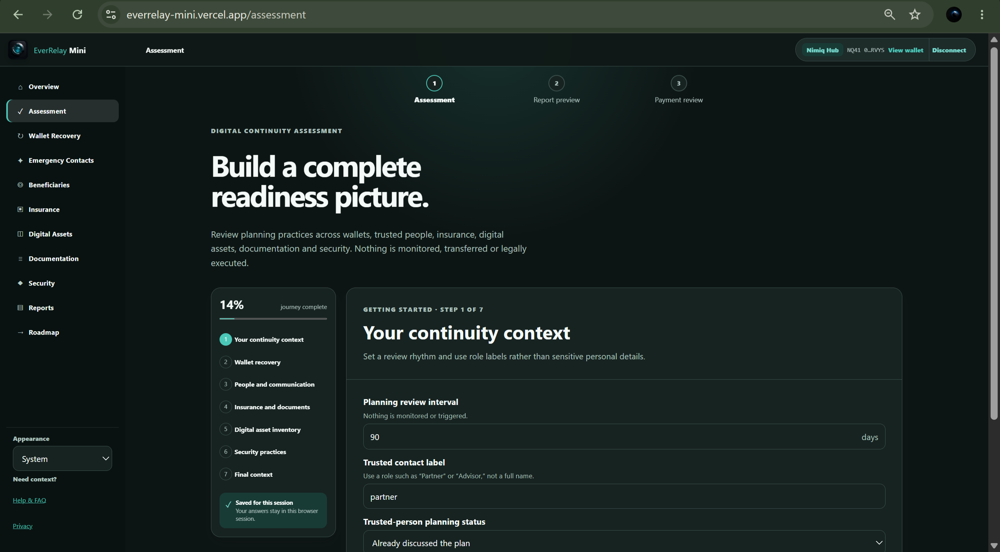
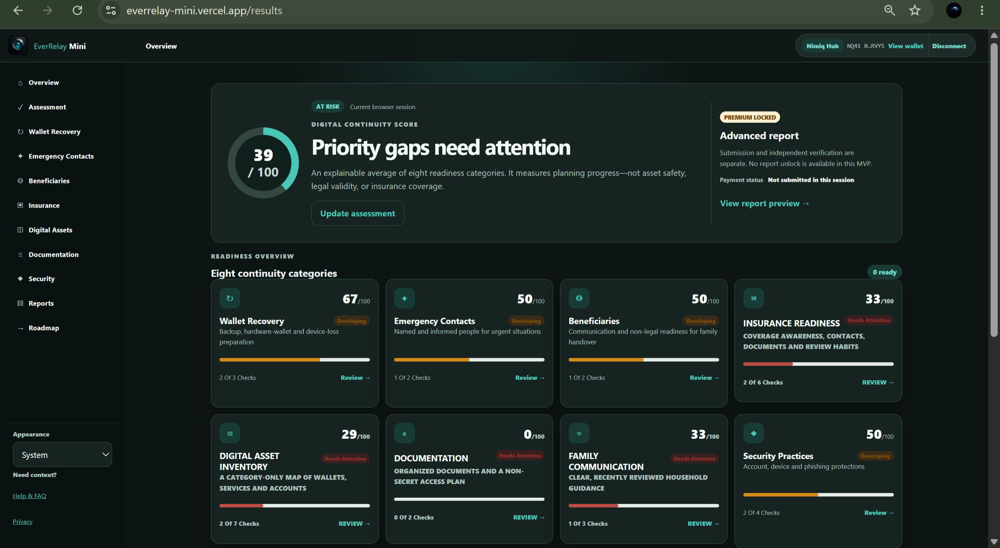

# EverRelay Mini

> Prepare your digital life before emergencies happen.

| Field | Value |
| --- | --- |
| Category | Productivity |
| Pricing | Free |
| Team name | _Not provided — optional_ |
| Team members | _Not provided — optional_ |
| X account | sopskistar |
| Contact email | julianahonour20@gmail.com |
| GitHub login | @sopskistar |
| Submitted at | 2026-07-30T02:20:22.924Z |

## Links

| Link | URL |
| --- | --- |
| Repo | [https://github.com/sopskistar/everrelay](<https://github.com/sopskistar/everrelay>) |
| Demo | [https://everrelay-mini.vercel.app](<https://everrelay-mini.vercel.app>) |
| Video | [https://youtu.be/R2Ud-gp6_ug](<https://youtu.be/R2Ud-gp6_ug>) |

## Description

EverRelay Mini helps users prepare for emergencies, device loss, and family handover through secure Nimiq wallet connectivity and privacy-first readiness assessments covering wallet recovery, insurance, trusted contacts, digital assets, documentation, and security.

## Builder story

EverRelay Mini was inspired by a simple question: if something unexpected happened today, would our families know how to recover or manage our digital lives?

As more of our finances, identities, insurance information, and digital assets move online and on-chain, most people focus on protecting their wallets but rarely prepare for emergencies, incapacity, or family handover. Important insurance contacts, recovery plans, trusted contacts, and critical documents are often scattered or never organized until it's too late.

We built EverRelay Mini to help users assess their digital continuity without taking custody of their wallets or collecting sensitive information. By combining secure Nimiq wallet connectivity with practical readiness assessments across wallet recovery, emergency contacts, insurance readiness, digital assets, documentation, and security practices, EverRelay Mini gives users a clear action plan to strengthen their preparedness before an emergency happens.

## Thumbnail

## Screenshots

---

_Generated from the submission form. `submission.yaml` in this folder is the machine-readable source of truth._
