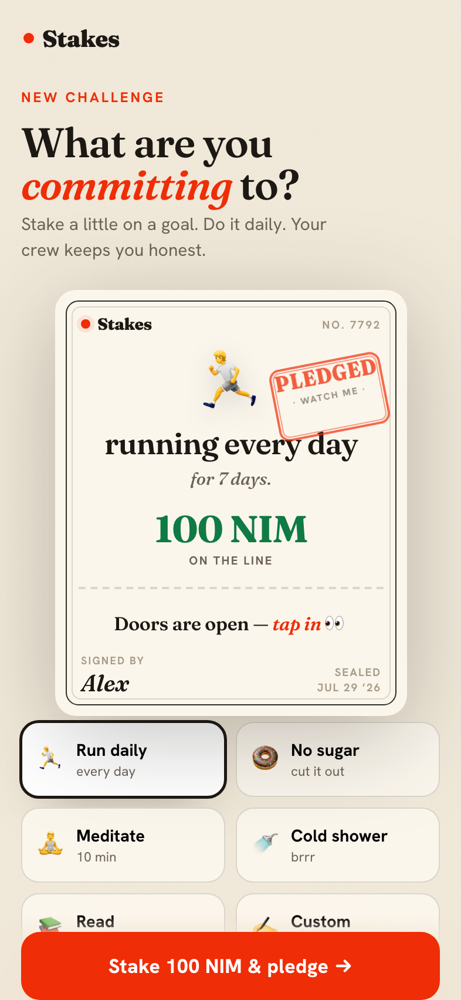
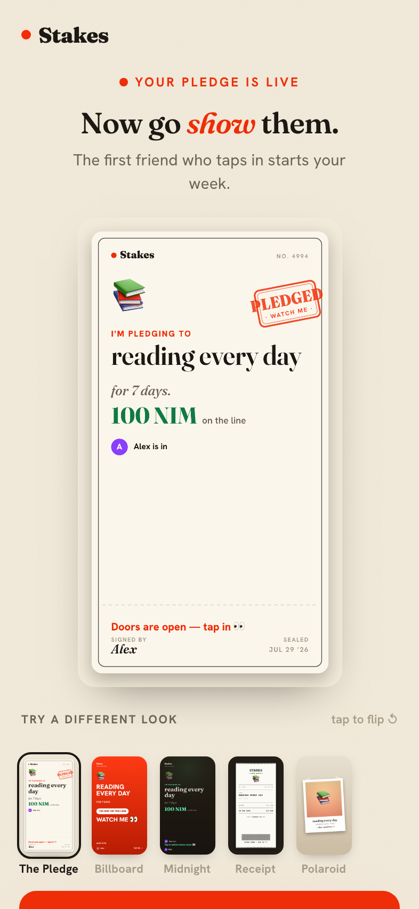
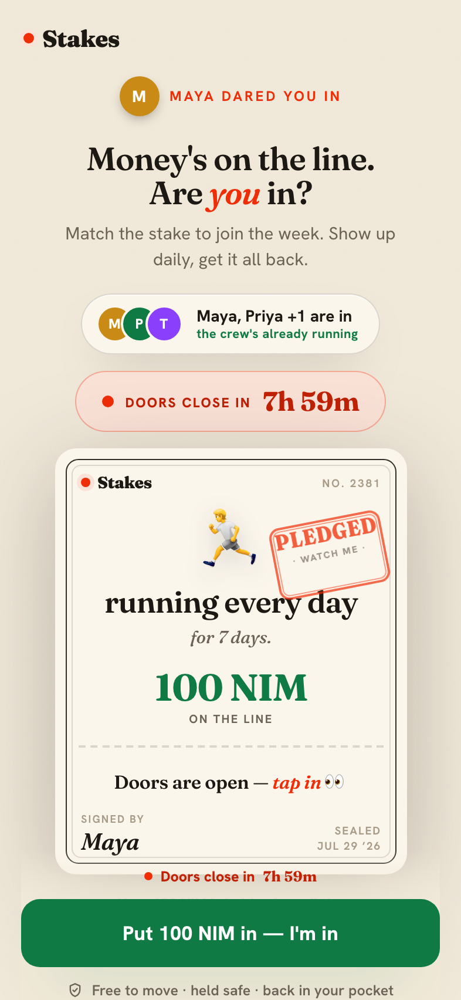
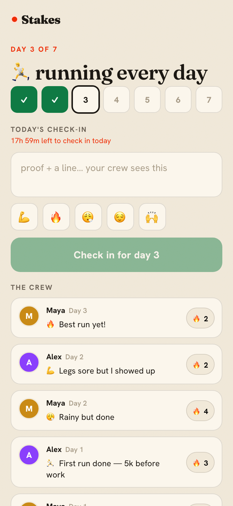
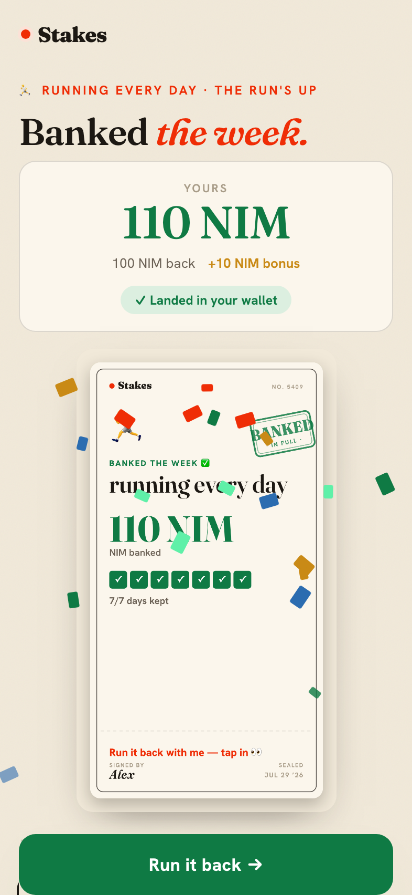

# Stakes

> An app to quit quitting.

| Field | Value |
| --- | --- |
| Category | Social |
| Pricing | Free |
| Team name | _Not provided — optional_ |
| Team members | _Not provided — optional_ |
| X account | surfstyk |
| Contact email | surfstyk@yahoo.com |
| GitHub login | @surfstyk |
| Submitted at | 2026-07-31T06:43:36.186Z |

## Links

| Link | URL |
| --- | --- |
| Repo | [https://github.com/surfstyk/stakes](<https://github.com/surfstyk/stakes>) |
| Demo | [https://stakes.surfstyk.com](<https://stakes.surfstyk.com>) |
| Video | [https://www.youtube.com/watch?v=ptgumWH57r4](<https://www.youtube.com/watch?v=ptgumWH57r4>) |

## Description

An app to quit quitting. Stake a little NIM on a weekly goal, check in each day, and get it all back plus a bonus when you follow through. Miss a day and you forfeit that slice. No tracking, no AI: your crew keeps you honest.

## Builder story

The idea came from my bathroom, not a brainstorm. My wife and I decided we'd take a cold shower every morning. No app, no protocol, just the two of us agreeing that's a thing we do now. It stuck. And it stuck for a reason that has almost nothing to do with willpower: it stuck because the other person knows. That's the whole product.

Stakes lets anyone run that with their crew. You put a little NIM on a goal, your friends stake the same to join, and you check in once a day. Miss the window and that day's slice is gone; finish clean and you get it all back plus a bonus. I build AI agents for a living, so the obvious feature was a camera and a model to "verify" you actually did it. I left it out on purpose: the moment a model becomes the referee, what your friends were doing stops being trust and starts being compliance. So the split is the brand — the money is handled by systems, the truth is handled by people. And because it runs on Nimiq Pay, the stake moves in one native tap: no gas, no seed phrase, no crypto homework. It feels like a bet between friends. There just happens to be a blockchain underneath.

## Thumbnail

## Screenshots

---

_Generated from the submission form. `submission.yaml` in this folder is the machine-readable source of truth._
